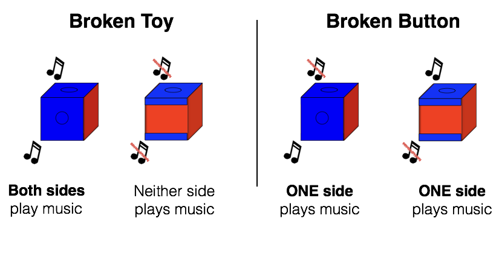

```{r setup, include=FALSE}
knitr::opts_chunk$set(echo = FALSE, message = FALSE, warning = FALSE)
```


```{r}
source('thesis_code.R')
```


# Abstract

From a young age, children will spontaneously help others achieve goals. In many circumstances, however, it is unclear why exactly someone is failing to achieve a goal. In these situations, it is necessary to figure out the likely reason they are failing so that you can tailor your help accordingly. In the three experiments described in this thesis, 24- to 48-month-old children learned about three (Exp. 1) or two (Exp. 2 and 3) music toys. They then watched a confederate fail to activate a toy and request help. We varied the likely source of this confederate's failure and, in all three experiments, children were able to use their prior knowledge about the toys to target the likely source of failure. When the likely source was the toy itself, children helped by changing the toy. When the likely source was the action taken on the toy, children helped by changing the action taken on the toy.

\newpage

# Introduction

Humans, both as adults and as children, routinely help others. Adults help strangers, family members, and people in-between. They will hold open doors for people whose hands are full, cook food for people who are hungry, donate money to people who ask for it, and give directions to tourists. In all these situations, the helper has to think about the other person. Helping requries an understanding of both the other person's goals and what stands in the way of her achieving those goals [@Warneken2006]. Those goals can be action-based (e.g., opening a door), or more abstract (e.g., learning algebra), and the obstacles can stem from the person's own abilities, from the physical world, or from other people. Helping is therefore a complicated cognitive skill. It requires an understanding that others have goals, the ability to determine, often from ambiguous evidence, what those goals are, and the understanding that various types of obstacles can prevent them from achieving those goals. Helping effectively also requires that you understand how to remove or alleviate the obstacles to your social partner's goals, which can require you to have prior experience with the situation (e.g., knowledge of algebra) or particular skills (e.g., atypical strength). 

When you help, you always give *something*, but what exactly you give will depend on the situation and the goals of the person you are trying to help. Helpers typically provide either goods, services, or information [@Tomasello2009]. These varieties of helping vary not only in the currency of the helping behavior, but also in the specific cognitive skills required to help effectively. Providing goods requires knowledge about what kinds of goods can fulfill various goals. Providing services requires the physical and cognitive abilities to perform those services. Informing, however, involves the additional requirement of understanding what it is that you know that the other person does not. You may realize that the other person has a false belief, or just that she is ignorant of some crucial piece of knowledge. Informing also does not necessarily involve verbally explaining the missing piece of information; pointing or demonstrating can be informative.

Here we investigate how 2- and 3-year-olds help others. Much of the helping literature has focused on if and when children help. However, helping can also be seen as a decision about how to help that depends on inferences about another person's goals and beliefs, as well why the likely reason behind that person's failure. In three experiments, we varied the likely source of a confederate's failure to investigate if children are able to recruit prior knowledge and causal reasoning skills to effectively target the source of the confederate's failure when helping. 

This introduction will first survey the literature on if and when children help, and then relate the literature on goal attribution, belief reasoning, and causal reasoning to helping in childhood.

## When do children help?

By their second birthday, children willingly help others in a variety of contexts. Infants as young as 12 months will point to show others objects for which they are looking [@Liszkowski2006]. They are also sensitive to exactly what information others lack, and will selectively point out only the information that others need to fulfill their goals [@Liszkowski2008]. At 18 months, children will reliably hand adults objects out of their reach, open doors for them if their hands are full, and correct their actions on a simple toy [@Warneken2006]. Children in these experiments not only spontaneously helped in the various situations, but were able to discern when the adult needed help and when they did not. For example, infants were more likely to pick up a dropped object for the adult if she dropped it accidentally than if she purposefully threw it on the floor. Thus, by 18 months, infants are sensitive to information about what others' goals are, and will only help if they perceive that the other person may not be able to meet those goals by herself. 

There is evidence that children's propensity to help and the types of situations in which children will help changes during the second and third years of life. One-year-olds are less likely to help overall than two-year-olds, and also do not help reliably in situations that require them to respond to emotional distress [@Svetlova2010]. They may also require more communication from their social partner in order to help than two-year-olds, as increased requests for help and scaffolding from a social partner can increase the likeliness that a one-year-old will help [@Svetlova2010; @Spinrad2006]. 

Young children's propensity to help also varies with the specifics of the helping scenario. Different situations require different cognitive and social skills, as well as different motivations [@Thompson2013]. Instrumental helping, which requires the helper to perform some action to fulfill the partner's goals, requires the ability to understand others' goals and determine the correct actions to take to fulfill those goals. Sharing and responding to emotional distress may be more difficult. Sharing requires incurring an immediate cost, and responding to emotional distress, children must reason about the emotions of others and which actions could positively affect those emotions. Informing, as mentioned previously, requires the helper to reason about the differences in knowledge between herself and her partner. Children first help consistently in instrumental tasks [@Schachner2018; @Svetlova2010]. Both the 18- and 30-month-olds in Svetlova et al.'s (2010) study helped appropriately more often in situations that involved action-based helping than in situations that involved responding to emotional distress or giving up something of their own (e.g., a favorite toy). However, a majority (87%) of the 30-month-olds helped appropriately in response to emotional distress, whereas only 13% of the 18-month-olds did so. 

The 18-month-olds in Warneken and Tomasello's (2006) study also demonstrated considerable variability in helping behavior depending on the specifics of the task. Some of the tasks involved instrumental helping (e.g., fetching out-of-reach objects for the experiment, removing physical objects), but others involved informing the experimenter about the correct way to use an object once the child had observed her using it incorrectly. In these tasks, children had to observe the experimenter's actions and infer that they posssessed crucial knowledge taht the experimenter lacked. Fewer children helped in these types of tasks than in the ones that required instrumental helping.

Therefore, children begin to help others early in life, but the context and type of help required are important. Children do not start helping in all scenarios at the same time. It is still unclear exactly why this variability exists. Different scenarios do require different motivations---a scenario involving emotional distress requires that the child is motivated to alleviate that distress, while other scenarios may the child to incur a heavy cost by giving up a possession. However, different scenarios require different cognitive abilities as well, which may also influence the scenarios in which children of various ages are willing to help. The remainder of this introduction will examine cognitive abilities commonly involved in helping scenarios and discuss how these abilities might influence helping behavior. 

## Reasoning about others' goals

First, helping requires an understanding that other agents possess goals, as well as the ability to infer those goals from an agent's actions. An accurate understanding of an agent's goals is necessary in order to help effectively, but is also critical to the process of realizing that someone needs help.

Children start to understand goal-directed actions at a very young age. After watching an agent repeatedly choose on object over another, infants as young as 5 months expect that the agent will continue choosing that object, suggesting that they see this type of action as goal-directed [@Luo2005; @Woodward1998]. Csibra (2008) showed 6.5-month-olds an inanimate object that repeatedly moved around obstacles to reach a destination. Those infants expected the object to then move efficiently towards the destination once the obstacles were removed, suggesting both that they understood motion paths as goal-directed and that they expected agents to achieve goals efficiently [@Csibra2008]. At 9 months, children can distinguish between situations in which an adult does not want to give them a toy and situations in which she is unable to do so [@Behne2005]. By 18-months, children can infer the intentions of others even from incomplete actions [@Meltzoff1995]. This skill is particularly crucial when helping others, as people in need of help typically fall short of their intended action, and it is thus necessary to infer a goal without witnessing the person accomplish that goal first. 

It is easier for children to understand another's goal when they have experience with the actions required to complete that goal themselves [@Sommerville2005; @Sommerville2005a]. This suggests that children may have a more difficult time helping in tasks in which they are unfamiliar with the actions involved, not only because they do not know how to help, but also because they may be unsure of the other person's goal. 

Goal attribution often involves reasoning about the preferences of others. Agents sometimes choose objects at random because they have no preference for any one object over another. However, choices are often indicative of a preference for a specific object or object type. It is important to distinguish between these two scenarios when helping someone with an object, as it is often necessary to know if they need help with a specific object (i.e., they need to open *their own* car door) or if any object of a certain type will do (i.e., they need *any* AA battery). Spaepen and Spelke (2007) explored how 12-month-olds reasoned about the goal behind an agent's reach. Their results suggest that infants use global features or known category membership when attributing goals (e.g., a truck versus a doll), but not more fine-grained information (e.g., a red pickup truck versus an orange dump truck). Together, these studies suggest that infants use information about both the object an agent chooses itself and the environment from which the agent chooses the object when attributing a goal to an agent. 

Therefore, young children are able to both attribute goals to agents and determine what type of actions are likely to indicate a goal. These skills are crucial in helping scenarios in which it is necessary to infer an agent's goal from actions alone.  

## Reasoning about the beliefs of others

However, understanding a goal from observing someone's actions alone is often not sufficient in order to help effectively. In many scenarios, helping requires reasoning about the beliefs of others. Informing scenarios, as discussed earlier, always involve taking into account the information that you possess that your social partner lacks. 

Furthermore, it is sometimes necessary to understand what information a person lacks in order to accurately understand that person's goals. For example, in Buttelmann, Carpenter, and Tomasello (2009), toddlers learned how to operate two boxes with locks. They watched an experimenter put a toy in one of the boxes and then leave the box unlocked. In one condition, the "False Belief" condition, the experimenter then left the room and a second experimenter moved the toy into the second box. In the other condition, the "True Belief" condition, the first experimenter remained in the room the entire time. The first experimenter also locked both boxes. After the toy was moved, the second experimenter then kneeled down by the box that he had originally placed the toy in and tried to open it. Children could then approach either box. Children in the False Belief condition tended to open the box containing the toy, but children in the True Belief condition tended to open the box that the experimenter was actively trying to open. These results indicate that children attributed different goals to the experimenter depending on whether he had seen the toy move to the second box. 

Buttelmann, Carpenter, and Tomasello argue that this suggests children in the False Belief condition understood that the experimenter had the false belief that his toy was in the original box. However, a leaner interpretation is that the children simply attributed ignorance to the experimenter (i.e., he did not know where his toy is), and subsequently saw his choice as a random one between two boxes. The authors argue that this is an implausible explanation because children needed to realize that the experimenter possessed "cognitive context driving his behavior" [@Buttelmann2009, p. 341]. However, it is possible that children in the False Belief condition thought that the experimenter possessed no belief about where the toy was, but still understood that he possessed the goal of retrieving his toy. 

In this study, children needed to reason about what they knew that the experimenter did not. In the False Belief condition, children possessed two pieces of knowledge that the experimenter did not: how to open the locked boxes and the location of the toy. In the True Belief condition, the experimenter knew the location of the toy but did not know how to open the locked boxes. Therefore, this suggests that young toddlers are not only sensitive to differences in knowledge between themselves and their social partner when deciding how to help, but are also able to decide which piece of knowledge that they possess is most pertinent to their social partner's goals, and use that knowledge to guide how they help.
  
## Causal reasoning

Finally, even if a child understands someone's goal and how knowledge relates to that goal, it is often unclear what obstacle prevents her from achieving that goal. In many of the helping studies described previously, the helpful action for the child to take did not rely on the cause of the experimenter's failure. In Warnekan and Tomasello (2006), for example, the instrumental helping tasks involved only one source of failure (e.g., the experimenter could not open the cupboard door) and, furthermore, the correct action could usually be inferred directly from the experimenter's goal. Although the more complicated Buttelmann et al. (2009) task involved multiple sources of failure (ignorance about the toy's location; how to open the locked boxes), children did not have to reason about which cause was more likely than the other. Instead, the helpful action depended only on the confederate's goal (i.e., to either retrieve the toy or open an empty box) and knowledge of a single barrier (the locks) preventing the experimenter from achieving his goal. 

Many helping scenarios, however, do involve choosing between multiple possible sources of failure. For example, consider someone trying to turn on a television with a remote. You watch him push a button, but nothing happens. It is possible that he is operating the remote incorrectly by pushing the wrong button, but it is also possible that the remote is out of batteries, the television is broken, he has the wrong remote, etc. Although you could try them all, you might want to help him as quickly as possible. You may also have a sense of which causes are more likely than others based on prior experience with televisions, remotes, or this particular person. Once you have decided which cause to target first, you will also need to devise an appropriate intervention. For example, if you think he is pushing the wrong button, you will need to push, or in some way direct him to push, the correct button. 

Children as young as two are able to use variation and covariation information to infer the physical cause of a physical effect, and, by age three, children are able to intervene on such a system to stop the physical effect [@Gopnik2001]. Schulz and Gopnik (2004) suggests that this type of reasoning extends to other domains as well. They introduced 3- and 4-year-olds to a monkey that sneezed when in contact with some flowers, but not others. Similar to the children in Gopnik et al. (2001), these children were able to detect the flower that caused the monkey to sneeze when shown that the monkey sneezed in the presence of single flower, or in the presence of that flower and another flower, but not in the presence of the second flower only. Children were also able to keep track of the conditional probabilities that different flowers caused the monkey to sneeze when shown only various pairs of flowers, as well as intervene to remove the flower that caused the monkey to sneeze. They created a second set of scenarios in which children had to figure out which animal made a bunny scared. Children were again able to reason about cause of the bunny's fear and intervene by removing the causal animal. This works suggests not only that young children are able to reason about the cause of an effect and intervene to stop the effect, but also that they are able to do so when the effect in question is a reaction, either physical or psychological, of another agent. Young children may therefore be able to recruit their causal reasoning abilities in helping scenarios, which often involve reasoning about why a certain effect or emotion has been produced in other agent. 

Furthermore, previous work by Gweon and Schulz (2011) suggests that children as young as sixteen months are capable of inferring the causes of their *own* failed actions and helping themselves accordingly. In the study, children either witnessed that a toy sometimes worked and sometimes did not, regardless of who operated the toy, or that the toy worked for some agents but not others. Children were then given the opportunity to try the toys for themselves, but the toys never activated. Children who witnessed that toy functionality did not depend on the agent were more likely to reach for a new toy, suggesting that they attributed their failure to the toy itself. In contrast, children who witnessed that toy functionality did depend on the agent were more likely to hand the toy off to a parent, suggesting that they attributed the failure to themselves.  

## Current Experiments

We designed three experiments to investigate 24- to 48-month-olds ability to reason about the causes of others' failed actions and then offer effective help. In all three experiments, children observed an adult fail to activate a toy either because she took the wrong action on the toy or because she selected a broken toy. The adult then asked the child for help and the child could choose between helping her with the toy she had already tried or with a second toy. The effectiveness of each choice varied with the actual cause of the adult's failure. Therefore, if children are able to reason about the cause of the adult's failure and address that cause when helping, their responses would also vary with the cause of her failure. 

Much has been written about altruism in humans [@Warneken2009; @Tomasello2009], but helping is not necessarily altruistic. Regardless of whether the helper is rewarded for her help, she had to harness the various cognitive skills discussed earlier. Therefore, the research discussed in this thesis investigates the cognitive skills involved in helping without dwelling on the exact motivations of the children involved. We wanted to know how children help when they are motivated, for whatever reason, to do so, and thus took various steps to motivate children to help. 

# Experiment 1

We presented children with a situation in which there were multiple ways to help another person. We manipulated the likely cause of the person's failure, which made one course of action more helpful than another. 

## Methods

### Participants

```{r three-toy}
summary_three_toy <- summary_tibble(three_toy_tidy)

# excluded kids 
# check that these codes are right--some are different than ones in cogsci
num_excluded <-
  three_toy %>% 
  get_num_excluded(excludeCode, parent, exp, withdrew)
```

We recruited 52 24- to 48-month-olds (M(SD) = `r summary_three_toy$mean_age`(`r summary_three_toy$sd_age`)yrs, `r summary_three_toy$perc_female`% female) from a museum in Palo Alto, CA. An additional `r num_excluded$total` children were excluded from analysis due to parental interference (n = `r num_excluded$parent`), experimenter error (n = `r num_excluded$exp`), or shyness (n = `r num_excluded$withdrew`). We randomly assigned children to one of two conditions: the Broken Toy condition (n = `r summary_three_toy$num_bt`; M(SD) = `r round(summary_three_toy$mean_age_bt, 2)`(`r summary_three_toy$sd_age_bt`)yrs) or the Broken Button condition (n = `r summary_three_toy$num_bb`; M(SD) = `r summary_three_toy$mean_age_bb`(`r summary_three_toy$sd_age_bb`)yrs).

### Stimuli
We constructed three identical-looking toys. One side of each toy was covered in yellow felt and had a yellow button in the center. The opposite side was covered in red felt and had a red button in the center. The yellow button on two toys played music, while the yellow button on the third toy was inert. All red buttons were inert. The toys were placed on a white plastic tray and covered with grey felt. See Figure 1 for a schematic of the toys.

```{r, fig.cap="Schematic of toys used in Experiment 1", out.width='60%'}
include_graphics("images/three-toy-schematic.png", dpi = NULL)
```


### Procedure
The experiment began with a *warm-up phase* in which a confederate and experimenter engaged the child in reciprocal games (e.g., rolling a ball back and forth through a tube) in order to help the child feel comfortable with the researchers, and promote general helping behavior (see Cortes Barragan & Dweck, 2014). After approximately 5 minutes of warm-up, the confederate excused herself from the room, explaining that she had work to do.

Then, the child gained experience with the toys during the *play phase*. The experimenter behaved as if she were exploring the toys for the first time. She took one toy out at a time and showed it to the child. In the Broken Toy condition, the toys were oriented such that the yellow side was on top. She noticed the yellow button, pressed it, and reacted positively to the music that played. She also encouraged the child to press the yellow button and again reacted positively, saying, “Music! The yellow side plays music!”. She then turned the toy around in her hands until she discovered the red button on the opposite side, and expressed mild surprise, as if she did not expect it to be there. She pressed the red button and also encouraged the child to do so, acting perplexed and disappointed that it did not play music. The experimenter then took the second toy out, which she and the child explored in the same way (i.e., the experimenter pressed each button, and then encouraged the child to do so). This second toy was always the broken toy. This process was repeated with the third toy, which functioned the same as the first (i.e., the yellow button played music, but the red button did nothing). The child and experimenter then explored each toy again, taking turns pressing the buttons. The Broken Button condition proceeded identically except that the toys were placed with the red side up, such that the red button was discovered first, and then the yellow. By the end of the play phase, all children experienced that pressing the yellow buttons on two of the toys played music (and one was inert), and that none of the red buttons played music. See Figure 1 for a schematic of the play phase.

```{r, fig.cap="Order in which children saw and pressed the buttons in each of the conditions. Children explored both buttons on a toy before moving onto the next toy. In the Broken Toy condition, children encountered the yellow button on each toy before the red button. In the Broken Button condition, children encountered the red button on each toy before the yellow button.", out.width='60%'}
include_graphics("images/three-toy-play-phase.png", dpi = NULL)
```


In the helping phase, the experimenter placed toys back on the tray and covered them with the felt. The toys were placed as they were during the play phase: yellow-side-up in the Broken Toy condition, and red-side-up in the Broken Button condition. The child sat approximately 6 feet away from the tray, either by herself or with a parent. The experimenter then called the confederate back into the room and explained that she and the child were playing with toys that played music. The confederate said, “I love music!” and knelt down behind the tray, facing the child. She appeared to think about which toy to select, then said, "Hmm, I think I'll play with this one!" She then took a toy out from behind the felt such that the child could not see from where on the tray the toy was selected. She placed her chosen toy in front of her and moved the tray containing the remaining two toys, covered by felt, off to one side (counterbalanced).

She then pressed the button on top of her chosen toy (the yellow button in the Broken Toy condition; the red button in the Broken Button condition). The toy did not play music. The confederate remarked, “Hmm, no music!” and pressed the button again, expressing disappointment and saying, “Still no music! I really want to play music!” She then put one hand on the tray, and at the same time, slid her toy with the other hand such that it was parallel with the tray but on her opposite side. Once the toy and tray were equidistant from the confederate, she removed her hand from the toy and removed the felt from the tray to reveal the two other toys. She then gestured to both the toy and the tray and asked, “Can you help me play music?” The toy and tray were far enough apart (approximately 2 feet) and from the child (approximately 5 feet) that the child could not approach both simultaneously.

If the child did not respond, the confederate and experimenter provided planned prompts, waiting 5 seconds in between, until the child responded. The last of these prompts involved the confederate moving closer to the child (approximately 2 feet) and placing the tray and the toy within the child’s reach but still far enough apart that the child could only reach to only one location at a time.

Thus, the only differences across conditions involved what color button the child perceived as the bottom or hidden buttons. In the Broken Toy condition, the experimenter presented the yellow button of each toy to the child first, then revealed the non-obvious red button. The toys were still oriented this way when the confederate came in, chose her toy, and acted upon the toy. In the Broken Button condition, the experimenter presented the red, inert buttons first, and the red buttons were on top during the confederate's interaction with the toys.

```{r, fig.cap="Depiction of the helping phase in the Broken Toy condition. The Broken Button condition proceeded identically, except that all three toys were oriented such that the red button was on top.", out.width='60%'}
include_graphics("images/three-toy-helping-phase.png", dpi = NULL)
```

#### Dependent Measures

The measures of interest were which toy children acted on and what actions they took on that toy after the confederate’s failure (i.e., her first button press). The target toy was coded either as the "confederate's toy" or the "toys on the tray." All children who responded fell into one of these two categories.

To code what children did with the target toy, we coded whether the behavior was “successful" or “unsuccessful” in achieving the confederate’s goal of playing music. In the Broken Toy condition, we coded a child’s first response as “successful” if the child pressed the yellow button on a toy from the tray or directed the confederate to press it (e.g., telling her to do so, pointing, or handing her a toy yellow-side-up). “Unsuccessful” responses included pressing or directing the confederate to press the red button on any toy or the yellow button on the confederate’s toy. In the Broken Button condition, we coded a behavior as “successful” if a child flipped and pressed the yellow button or directed the confederate to do so (e.g., telling her to press it, flipping a toy and handing it to the confederate or pointing to a yellow side). Therefore, in the Broken Button condition, children could respond successfully regardless of which toy they targeted. In the Broken Toy condition, however, children could only respond successfully if they targeted the toys on the tray. A researcher blind to the hypotheses also coded these transcriptions for reliability and agreement with the original coder was 100%. [**note to sara: check**]

## Results

```{r response-3-toy}
# Response: Between condition differences -- Fisher's exact test
three_between_response <- 
  three_toy_tidy %>% 
  between_condition_response(digits = 3)

# Response: Within condition differences -- 2 two-tailed binomial tests
three_within_response <-
  three_toy_tidy %>%
  within_condition_response(digits = 3)

# Helpfulness: Between condition differences -- Fishers exact test
three_between_help <-
  three_toy_tidy %>%
  filter(n != 11) %>%
  between_condition_helpful(digits = 3)

# Helpfulness: Within condition differences -- 2 two-tailed binomial tests
three_within_help <-
  three_toy_tidy %>%
  filter(n != 11) %>%
  within_condition_helpful(digits = 9)
```

Children in both conditions saw the same set of toys and watched the confederate perform the same action (pressing an obvious button on the top of a toy, which subsequently did not play music). All children could then either approach the toy the confederate had just pressed or a toy on the tray. The conditions differed only in the likely source of the confederate's failure to play music. We manipulated the likely source of her failure by varying whether the button pressed by the confederate was the type of button that worked on a majority of the toys (i.e., a yellow button; Broken Toy condition) or the type of button that was always inert (i.e., a red button; Broken Button condition).  

We predicted responses to vary across conditions depending on the source of the confederate’s failure. In the Broken Toy condition, the confederate pressed a yellow button. From this action alone, it is possible to infer that she has the inert toy, since yellow buttons produce music on all toys except one. The source of her failure is therefore the toy itself. Her action (pressing a yellow button) would have produced music if she had chosen another toy. The child can thus only help the confederate achieve her goal of playing music by targeting a new toy from the tray.

In the Broken Button condition, however, it is only possible to infer that the confederate is taking the wrong action on a toy (i.e., pressing a red button instead of a yellow one). Each toy has an inert red button, so the confederate's action provides no information about which type of toy (functional or inert) she has chosen. Therefore, in this condition, children could help the confederate by approaching either the confederate's toy or the toys on the tray. Because children in this condition could help by approaching any toy, but children in the Broken Toy condition could only help by approaching the toys on the tray, we predicted that more children would approach the “toys on the tray” in the Broken Toy condition than in the Broken Button condition. As predicted, children were significantly more likely to direct their help toward a toy on the tray in the Broken Toy condition than in the Broken Button condition (`r three_between_response$perc_bt`% vs. `r three_between_response$perc_bb`%; two-tailed Fisher’s Exact Test, p = `r three_between_response$p_value`).

```{r, fig.cap="Proportion of children whose first response was directed to the confederate’s toy (blue) or the toys on the tray (red) in the helping phase. Error bars: bootstrapped 95\\% CI.", out.width='60%'}

fig_num_counter <<- 3

three_toy_tidy %>% 
  plot_responses("Experiment 1: ")
```

We then looked at children’s responses within each condition. In the Broken Toy condition, children could not help fulfill the confederate's goal of producing music by acting on the confederate's toy. We thus predicted that children in this condition would preferentially direct their help toward a toy on the tray. As predicted, children were more likely to approach the “toys on the tray” than the “confederate’s toy” (`r three_within_response$num_bt`/`r summary_three_toy$num_bt`; two-tailed binomial test, p = `r three_within_response$p_value_bt`).

In the Broken Button condition, however, it is not clear which toy the confederate has chosen. There is a 33% chance that any toy is the inert toy, and thus all toys are equally likely to be capable of producing music. It is therefore reasonable to target any toy. However, there are several reasons to expect that children would prefer the confederate's toy in this condition. First, children may be inclined to approach the toy just acted upon by the confederate. Second, children may conclude that the confederate's goal is not just to play music, but to play music specifically with her chosen toy. Thus, we expected that children would show a preference for the confederate’s toy. The majority of children in the Broken Button condition did approach the "confederate's toy" (`r summary_three_toy$num_bb - three_within_response$num_bb`/`r summary_three_toy$num_bb`; two-tailed binomial test, p = `r three_within_response$p_value_bb`). See Figure `r fig_num_counter` for a summary of children’s first responses.

In the Broken Button condition, helping involved the more complex action of revealing a non-obvious button, but it was also possible to successfully help by targeting any of the three toys. All children in the Broken Button condition included in this analysis helped successfully (`r three_between_help$num_bb`/`r summary_three_toy$num_bb - 1`). One child in the Broken Button condition was dropped from this analysis because the camera angle prevented visual access to the content of her helping behavior. Children in the Broken Button condition were more likely to help successfully than children in the Broken Toy condition (`r three_between_help$perc_bb`% in Broken Button vs. `r three_between_help$perc_bt`% in Broken Toy; two-tailed Fisher’s Exact Test, p = `r three_between_help$p_value`). Within each condition, children were more likely to help successfully than unsuccessfully (Broken Button: `r three_within_help$num_bb`/`r summary_three_toy$num_bb - 1`, two-tailed binomial test, p < .001; Broken Toy: `r three_within_help$num_bt`/`r summary_three_toy$num_bt`, two-tailed binomial test, p = `r round(three_within_help$p_value_bt, 2)`).

```{r, out.width='60%', fig.cap="Proportion of children who responded successfully (green) versus unsuccessfully (gray). Error bars: bootstrapped 95\\% CI."}

three_toy_tidy %>% 
  filter(n != 11) %>% 
  plot_helpfulness("Experiment 1: ")
```

```{r}
glm_fit <-
  glm(firstChoiceCorrect ~ condition + age,
                  family = "binomial",
                  data = three_toy_tidy) %>%
  tidy() %>% 
  mutate(term = fct_recode(term, 
                           "Intercept" = "(Intercept)",
                           "condition:Broken Button" = "conditionBroken Button",
                           "Age" = "age")) %>% 
  mutate_at(vars(-term), funs(round(., 2))) %>% 
  rename(Term = term,
         Estimate = estimate,
         SE = std.error,
         `Z statistic` = statistic,
         p_value = p.value)

age_stats <-
  glm_fit %>%
  filter(Term == "Age") 

condition_stats <-
  glm_fit %>%
  filter(Term == "condition:Broken Button") 
```


```{r}
three_between_flip <-
  three_toy_tidy %>% 
  between_condition_flip(digits = 10)

three_within_flip <-
  three_toy_tidy %>% 
  within_condition_flip(digits = 6)
```

As a second exploratory analysis, we investigated how often children targeted a non-obvious (i.e., bottom) button. This is similar to the successfulness analysis discussed above---we coded children in the Broken Button condition as "helpful" if and only if they targeted a bottom button and "unhelpful" if they targeted a top button. However, in the Broken Toy condition, children could be unhelpful regardless of whether or not they targeted a bottom button. They could target a red button on a toy on the tray or confederate's toy, but they could also target the yellow button on the confederate's toy. The two codes were therefore distinct in the Broken Toy condition.

Children in the Broken Button condition were significantly more likely to target a non-obvious button than children in the Broken Toy condition (`r three_between_flip$perc_bb`% vs. `r three_between_flip$perc_bt`%; two-tailed Fisher’s Exact Test, p < 0.001). Furthermore, children in the Broken Button condition were significantly more likely to target a non-obvious button than an obvious button (`r three_within_flip$num_bb`/`r summary_three_toy$num_bb`, two-tailed binomial test, p < 0.001), while children in the Broken Toy condition were significantly more likely to target an obvious button than a non-obvious one (`r three_within_flip$num_bt`/`r summary_three_toy$num_bt`, two-tailed binomial test, p < 0.001). This provides more evidence that children are sensitive to the likely source of the confederate's failure and are able to use this source to guide how they help. 

```{r, out.width='60%', fig.cap="Proportion of children targeted an obvious button (yellow) versus a non-obvious button (orange). Error bars: bootstrapped 95\\% CI."}

three_toy_tidy %>% 
  plot_flip("Experiment 1: ")
```

```{r}
knitr::kable(glm_fit)
```

As an exploratory analysis, we also coded children’s first responses as “correct” (Broken Toy: “toys on tray”; Broken Button: “confederate’s toy”) or “incorrect”. We fit a generalized linear model with correctness as the outcome variable, condition as a categorical predictor variable, and age as a continuous predictor variable. This analysis revealed that age is a significant predictor of "correctness" ($\beta$ = `r age_stats$Estimate`, p = `r age_stats$p_value`), but that condition is not ($\beta$ = `r condition_stats$Estimate`, p = `r condition_stats$p_value`). For details, see Table 1.

## Discussion

These results suggest that 2- and 3-year-olds were able to use prior knowledge to infer the likely cause of another agent's failure and then effectively help the agent achieve her goal. When the likely cause of the confederate's failure was the toy itself (Broken Toy condition), children helped by changing the toy, but when the likely cause was the confederate's action on the toy (Broken Button condition), children helped by changing her action on that toy. Thus, children did not help in a uniform way across conditions; they responded to the likely cause of the confederate's failure. 

The only way to address the source of the confederate's failure in the Broken Toy condition was to target a new toy. However, in the Broken Button condition, there were multiple ways to fulfill the confederate's goal. Children needed to correct her action, by showing her that she needed to act on a yellow button instead of a red one, but they could do so on either the confederate's own toy or on a new toy. Each toy was equally like to have a functional yellow button, but children in this condition were more likely to show the confederate the correct action on the toy that she had previously chosen. It is possible that children are more inclined to approach a toy upon which someone has already chosen to act. However, it is also possible that children thought that the confederate's goal was to play music with her chosen toy, rather than to play music generally. 

Children not only responded according to the likely source of the confederate's failure, but also tailored their actions so that they effectively helped the confederate fulfill her goal. A majority of children in the Broken Toy condition targeted an obvious button, while a majority of children in the Broken Button condition targeted a non-obvious button, even though children saw the exact same toys in both conditions. This suggests that the children not only realized which toy could help the confederate fulfill her goal, but also which action to take on that toy would be the most effective. Furthermore, of the `r three_between_response$num_bb` out of `r summary_three_toy$num_bb` children in the Broken Button condition who targeted the toys on the tray, all targeted a bottom button. Thus, even though these children changed the toy, their behavior at their chosen toy suggests that they did not attribute the source of the confederate's failure solely to the toy itself. In contrast, none of the `r three_between_response$num_bt` children in the Broken Toy condition who targeted the toys on the tray targeted a bottom button.

[**note to sara: need to check this**]

We did find an age-related trend in terms of "correctness." However, this does not necessarily suggest that 2-year-olds are less capable of performing this task than 3-year-olds. Instead, it is possible that 2-year-olds are more likely to help by targeting the toys on the tray in this condition, which, as explained earlier, is still helpful. 2-year-olds may have a stronger aversion to acting on a toy that someone has already failed to work, or may interpret the confederate's goal differently than 3-year-olds. 


# Experiment 2

In Experiment 1, the Broken Button condition did not require children to infer the soruce of the confederate's failure. The confederate's mistake is marked in red and all possible helpful actions are marked in yellow because of how the toys are color-coded. Therefore, children in this condition can help effectively by remembering that yellow produces music, and do not need to infer that the confederate's  action on the toy is the source of her failure. This is not the case in the Broken Toy condition. Both the confederate's failed action and all helpful actions are marked in yellow. Children need to target a yellow button on a *new* toy and cannot simply target a particular color. To eliminate this alternative explanation in the Broken Button condition as well as the asymmetry between the two conditions, we designed a second experiment with two identical toys. 

We preregistered this experiment; the study plan is available at https://osf.io/3tx74/. 

## Methods

### Participants

```{r}
summary_two_toy <- summary_tibble(two_toy_tidy)

# excluded kids

num_excluded <-
  two_toy %>% 
  get_num_excluded(excludeCode, 
                   `experimenter error`, 
                   `pre-failure help`, 
                   `played before`,
                   `video`) %>% 
  rename(pre_failure_help = `pre-failure_help`)
```

We recruited `r summary_two_toy$num_participants` 24- to 48-month-old participants (M(SD) = `r summary_two_toy$mean_age`, `r summary_two_toy$perc_female`% female) from a local preschool. An additional `r num_excluded$total` children were excluded from analysis due to experimenter error (n = `r num_excluded$experimenter_error`), the child responding too early (n = `r num_excluded$pre_failure_help`), the child having prior exposure to the experiment (n = `r num_excluded$played_before`), or lack of video recording (n = `r num_excluded$video`). We randomly assigned children to one of two conditions: the Broken Toy condition (n = `r summary_two_toy$num_bt`; M(SD) = `r round(summary_two_toy$mean_age_bt, 2)`(`r summary_two_toy$sd_age_bt`)yrs) or the Broken Button condition (n = `r summary_two_toy$num_bb`; M(SD) = `r summary_two_toy$mean_age_bb`(`r summary_two_toy$sd_age_bb`)yrs).

### Stimuli

We constructed four toys, similar to those used in Experiment 1. Two opposite sides of each toy were covered in red felt and had a red button in the center. The others sides of the toys were covered in blue felt. Two of the toys were used in the Broken Toy condition and the other two were used in the Broken Button condition. The pair of toys used in the Broken Toy condition consisted of one toy with two buttons that played music when pressed and one toy with two inert buttons. The two toys used in the Broken Button condition were identical. One button on each toy played music when pressed, and the other was inert. In each condition, the two toys were placed in a woven basket. See Figure 4 for a schematic of the toys.

```{r, fig.cap="Schematic of the toys used in Experiment 2. All 4 toys were visually identical. In the Broken Button condition, the toys were also functionally identical. In the Broken Toy condition, one toy had two functional buttons and the other had two inert buttons.", out.width='60%'}

include_graphics("images/two-toy-schematic.png", dpi = NULL)
```


### Procedure

As in Experiment 1, the experiment consisted of a warm-up phase, play phase, and helping phase. During the warm-up phase, the confederate engaged the child in the same reciprocal games as in Experiment 1. The warm-up phase lasted approximately three minutes. This was two minutes shorter than the warm-up phase in Experiment 1 because the children in this experiment were already familiar with the experimenter and room in which the experiment was held. 

During the play phase, the experimenter and the child interacted with two of the four toys. The experimenter behaved in a manner similar to that of Experiment 1. In contrast to Experiment 1, however, children saw different sets of toys in each condition. The child engaged with the fully inert toy and the fully functional toy in the Broken Toy condition. In the Wrong Action condition, the child engaged with the two identical toys that each had one functional button and one inert button.

The play phase began with the two toys in the woven basket. The experimenter took one toy out of the basket. She remarked that it had a blue bottom on the top and pushed the button. In both conditions, this first button played music. The experimenter reacted positively to the music and said, "Music! It plays music!" She then asked the child if she would like to try and encouraged her to push the button. After the child pressed the button, the experimenter said, "Music! It plays music! This side plays music."

The experimenter then wondered aloud if the toy could do anything else, while turning the toy over in her hands. Upon finding the bottom button, the confederate acted mildly surprised and remarked that the toy had a blue button on the bottom. She then pressed the button. In the Broken Toy condition, this button played music. She reacted as she had to the top button, encouraged the child to press the button, then said, "Music! It plays music! This side plays music. So this toy plays music." In the Broken Button condition, however, the bottom button on the first toy did not play music. The experimenter remarked, "Nothing! No music," and shook her head while she spoke. She then encouraged the child to push the button. After the child had done so, she said, "Nothing! No music! This side does not play music. So only this side plays music," pointing to the functional side of the toy. 

The process was repeated for the second toy. The confederate placed the toy to the side and removed the second toy from the basket. In the Broken Toy condition, this toy was the inert toy. In the Broken Button condition, the inert button was on the top. The experimenter again remarked that the toy had a blue button on top. She pressed the button and it did nothing. She reacted as described previously (commenting that it did not play music, summarizing that the side did not play music after the child had pressed the button). The experimenter discovered the bottom button of the toy as she had with the first toy. In the Broken Toy condition, this button was also inert and the confederate acted as just described, and then remarked, "This toy does not play music." In the Broken Button condition, this button was functional. The confederate acted as she had when the button on the first toy had played music. Thus, by the end of the play phase, all children had either experienced that one toy had two functional buttons and one had two inert buttons (Broken Toy) or that each toy had one functional and one inert button (Broken Button).

In the helping phase, the experimenter returned the toys to the basket before placing the toys approximately 4 feet in front of the child and 4 feet 6 inches apart from each other. The midpoint between the two toys was directly in front of the child so that the child was equidistant from each toy. In the Broken Button condition, both toys were oriented so that the inert button was on top. In the Broken Toy condition, the side of the inert toy was counterbalanced. As in Experiment 1, the experimenter called the confederate back into the room and explained that she and the child were playing with toys that played music. The confederate responded, "I love music!" and stood 2 feet behind the toys such that she was equidistant from each toy. She glanced at each toy, then fixed her gaze on one (side counterbalanced) and said, "Hmm, I think I'll play with this one." She knelt behind her chosen toy and pressed the top button, which did not play music. As in Experiment 1, she remarked, "Hmm, no music!" and then pressed it again and said, "Still no music!" She then returned, still kneeling, to her original spot behind the toys and said, "I really want music! Can you show me?" while gesturing to each toy simultaneously.

In summary, the confederate appeared to choose between two toys that remained visible throughout the helping phase. She pressed only the top button on her chosen toy, as she had in Experiment 1. After failing to operate her toy, she then moved back so that she was no longer directly behind her chosen toy. At this point, she stated her goal and prompted the child to respond.

If the child did not respond, the confederate and experimenter provided additional prompts as in Experiment 1. They provided these prompts until either the child responded or the last prompt was given. Before delivering the final prompt, the confederate picked up both toys and brought them closer, but still out of reach, of the child.

If the child provided help that did not involve a physical demonstration (i.e., pointed or gave verbal instructions) before the confederate moved back to the center and gave her prompt, the confederate indicated that she had noticed the help by saying, "Ooh." She then moved back to the center, and said, "Can you show me?" If the child did not respond, the experimenter and confederate continued prompting as explained above.

#### Dependent Measures

As in Experiment 1, the key dependent measure was the target of the child's first response after the confederate's failure. We coded the target as either the toy that the confederate had acted upon ("confederate's toy") or the other toy that she had not touched ("other toy"). All children included in this experiment fell into one of these two categories. 

The consequence of each child's first response was also coded. We coded a response as "successful" if the behavior helped the confederate play music, and "unsuccessful" otherwise. In the Broken Toy condition, we coded a response as "successful" if the child pressed a button on the other toy or indicated (by pointing or verbally instructing) that the confederate should do so. We coded a response as "unsuccessful" if the target of the child's first behavior was the confederate's toy. In the Broken button condition, we coded a response as "successful" if the child flipped and pressed the bottom button on either of the two toys, or indicated (by pointing or verbally instructing) that the confederate should flip and press a bottom button. Unsuccessful behaviors involved acting on a top button or indicating that the confederate should act on a top button.

## Results
```{r}
# Response: Between condition differences -- Fisher's exact test
two_between_response <- 
  two_toy_tidy %>% 
  between_condition_response()

# Response: Within condition differences -- 2 two-tailed binomial tests
two_within_response <- 
  two_toy_tidy %>% 
  within_condition_response(digits = 3)

# Helpfulness: Between condition differences -- Fisher's exact test
two_between_help <-
  two_toy_tidy %>% 
  between_condition_helpful(digits = 3)

# Helpfulness: collapsed across conditions -- two-tailed binomial test
two_collapsed_help <-
  two_toy_tidy %>% 
  count(helpfulCategory) %>% 
  spread(helpfulCategory, nn) %>% 
  mutate(p_value = get_binom_p_value(Helpful, summary_two_toy$num_participants, digits = 10))

glm_control <-
  glm(firstChoiceCorrect ~ toySide + experimenter + confederate, 
      family = "binomial", 
      data = two_toy_tidy) %>% 
  tidy() %>% 
  mutate(term = fct_recode(term,
                           "Intercept" = "(Intercept)",
                           "Condition:Broken Button" = "conditionBroken Button",
                           "Age" = "age")) %>%
  rename(SE = std.error,
         `Z statistic` = statistic,
         `p-value` = p.value) %>% 
  rename_at(vars(term, estimate), str_to_title) %>% 
  mutate_at(vars(-Term), funs(round(., 2)))
```

To verify that children did not express a side bias or preference for any confederate or experimenter, we ran a logistic regression with "correctness" of response as the outcome and toy side, experimenter identity, and confederate identity as predictors. In the Broken Toy condition, "correct" responses were those that targeted the other toy; in the Broken Button condition, they were responses that targeted the confederate's toy. None of the coefficients were significant. See Table 2 for details.

```{r}
glm_control %>% 
  mutate(Term = str_replace_all(Term,
                            c("Sara" = "2", 
                              "Sophie" = "1", 
                              "Grace" = "5", 
                              "Huda" = "4", 
                              "Maria Marta" = "3"))) %>% 
  knitr::kable(digits = 2)
```

As in Experiment 1, children in each condition saw identical-looking toys and watched the confederate perform the same set of actions. We manipulated the cause of the confederate's failure by varying the functionality of the toy chosen by the confederate. In the Broken Toy condition, one toy is fully inert and one plays music. Thus, the source of the confederate's failure is her toy. However, in the Broken Button condition, each toy is capable of making music. The source of the confederate's failure is her choice of button, not her choice of toy.

Children in the Broken Toy condition were more likely to target the other toy than children in the Broken Button condition (`r two_between_response$perc_bt`% % vs. `r two_between_response$perc_bb`%; two-tailed Fisher’s Exact Test, p < .001). As in Experiment 1, children cannot help fulfill the confederate's goal by targeting her own toy, but children in the Broken Button condition can. This result therefore replicates the finding from Experiment 1, suggesting that children in this experiment again vary their helping responses with the likely source of the confederate's failure. It also suggests that the red and yellow visual markers from Experiment 1 are not necessary for children to infer the source of the confederate's failure and to use that information to help effectively.

```{r, out.width='60%', fig.cap = "Proportion of children whose first response was directed to the confederate’s toy (blue) or the other toy (red) in the helping phase. Error bars: bootstrapped 95\\% CI."}
two_toy_tidy %>% 
  plot_responses("Experiment 2: ")
```

Children in the Broken Toy condition were more likely to target the "other toy" than the "confederate's toy" (`r two_within_response$num_bt`/`r summary_two_toy$num_bt`; two-tailed binomial test, p < 0.001). This again replicates the result from Experiment 1, and provides further evidence that children in this condition are using their prior knowledge about the toys to guide their helping behavior.

We did not have a directed prediction for the Broken Button condition because, as described earlier, targeting either toy can be helpful. Children in the Broken Button condition showed no preference for either toy (`r two_within_response$num_bb`/`r summary_two_toy$num_bb`; two-tailed binomial test, p = `r two_within_response$p_value_bb`). 

```{r}
two_between_correct <-
  two_toy_tidy %>% 
  between_condition_correct()

two_collapsed_correct <-
  two_toy_tidy %>% 
  count(firstChoiceCorrect) %>% 
  spread(firstChoiceCorrect, nn) %>% 
  rename(incorrect = `0`,
         correct = `1`) %>% 
  mutate(p_value = get_binom_p_value(correct, summary_two_toy$num_participants, digits = 7))
```

In addition to responding to the likely source of the confederate's failure, children also targeted the toys in a way that could help the confederate fulfill her goal of playing music. We found no difference in the success of helping behavior across the two conditions (`r two_between_help$perc_bt`% in Broken Toy vs. `r two_between_help$perc_bb` in Broken Button; two-tailed Fisher’s Exact Test, p = `r two_between_help$p_value`). We then collapsed across conditions and found that children were more likely to successfully help than to unsuccessfully help (`r two_collapsed_help$Helpful`/`r summary_two_toy$num_participants`; two-tailed binomial test, p < 0.001). Thus,  

```{r, out.width='60%', fig.cap="Proportion of children who responded successfully (green) versus unsuccessfully (gray). Error bars: bootstrapped 95\\% CI."}
two_toy_tidy %>% 
  plot_helpfulness("Experiment 2: ")
```

As another secondary analysis, we investigated how often children in each condition exhibited the "correct" response. In the Broken Toy condition, "correct" responses are those that target the other toy. In the Broken Button condition, "correct" responses are those that target the confederate's toy. We found no significant difference across conditions (`r two_between_correct$perc_bt`% in Broken Toy vs. `r two_between_correct$perc_bb`% in Broken Button; two-tailed Fisher’s Exact Test, p = `r two_between_correct$p_value`). We then collapsed across conditions to test if children were more likely to respond "correctly" or "incorrectly" versus the alternative. Children were more likely to respond "correctly" than "incorrectly" (`r two_collapsed_correct$correct`/`r summary_two_toy$num_participants`; two-tailed binomial test, p < 0.001)

```{r}
two_between_flip <-
  two_toy_tidy %>% 
  between_condition_flip(digits = 10)

two_within_flip <-
  two_toy_tidy %>% 
  within_condition_flip(digits = 2)
```


Finally, as an exploratory measure, we again looked at how often children targeted a non-obvious, bottom button. Children in the Broken Button condition were significantly more likely to target a bottom button than in the Broken Toy condition (`r two_between_flip$perc_bb`% vs. `r two_between_flip$perc_bt`%; two-tailed Fisher's exact test, p < 0.001), indicating that children were using prior knowledge about the toys' functionality when responding to the confederate. Children were also more likely to target a non-obvious bottom button than an obvious top button in the Broken Button condition (`r two_within_flip$num_bb`/`r summary_two_toy$num_bb`; two-tailed binomial test, p = `r two_within_flip$p_value_bb`) and children in the Broken Toy condition were more likely to target an obvious button than a non-obvious button (`r summary_two_toy$num_bt - two_within_flip$num_bt`/`r summary_two_toy$num_bt`; two-tailed binomial test, p < 0.001). 

```{r, out.width='60%', fig.cap = "Proportion of children targeted an obvious button (yellow) versus a non-obvious button (orange). Error bars: bootstrapped 95\\% CI."}
two_toy_tidy %>% 
  plot_flip("Experiment 2: ")
```

## Discussion

In this experiment, 2- and 3-year-old children were again able to infer the likely cause of another's failure and offer appropriate help. This experiment served as a conceptual replication of Experiment 1. Although the toys were different, children still had to choose between helping the confederate with her own toy or a new toy, and the source of the confederate's failure varied in the same manner. In contrast to experiment one, the source of the confederate's failure was the only difference across conditions. We replicated our main finding from Experiment 1 that children's responses varied with the likely cause of the confederate's failure. We also replicated the finding that children in the Broken Toy condition were more likely to target a new toy than to target the confederate's toy. This suggests that children are able to infer the cause of the confederate's failure without the aid of visual markers. 

In contrast to Experiment 1, children showed no preference for either toy in the Broken Button condition. However, they did prefentially target non-obvious buttons, and were more likely to successfully help the confederate than to unsuccessfully help her. This provides evidence that children in this condition understood the toys and were able to address the source of the confederate's failure. Thus, children's lack of preference for a given toy does not imply that they did not know how to help the confederate. Instead, it suggests that they thought it was equally helpful to target either toy. 

The comparative helpfulness of targeting one toy over the other in the Broken Button condition depends on how specific the confederate's goal is: does she just want to play music in general (the *general* goal), or does she want to play music with her chosen toy (the *specific* goal)? She does explicitly choose a toy, but when she asks the child to "show her", she does not reiterate this preference. If she just wants to play music and has no toy preference, then it does not matter which toy the child helps her with. If she wants help with her chosen toy, then it more directly fulfills her goal to help her with that toy. However, because the toys are visually and functionally identical in this condition, it is also possible to show her how her own toy works by showing her how to operate the other toy. It is also possible that children in this condition are not distinguishing between the two toys. They may then not interpret the confederate's actions as indicating a preference for one toy over another, which in turn could imply that she possesses the general goal. This is consistent with prior research suggesting that young toddlers view a repeated choice between two objects as a preference if the two objects belong to different global categories, but will not view a repeated choice between two identical objects as an expression of a side preference [@Spaepen2007].

Regardless of the confederate's goal, it would be more expedient to target the confederate's toy, since children have more information about this toy. They do not know which button (functional or inert) is which on the other toy, but they can infer that the functional button is on the bottom of the confederate's toy. Children do not appear to be taking this into account. Although it is possible that they are not inferring that the bottom button must play music, it seems more likely that they are not motivated to help in the most efficient way possible, as there is nothing to indicate that they can only press one button or offer one piece of help.  

```{r}
three_two_combined <-
  three_toy_tidy %>% 
  mutate(experiment = 1) %>% 
  select(condition, firstChoice, experiment) %>% 
  rbind(two_toy_tidy %>% 
          mutate(experiment = 2) %>% 
          select(condition, firstChoice, experiment)) %>% 
  filter(condition == "Broken Button")

p_value_three_two_bb <- 
  get_fishers_p_value(table(three_two_combined$experiment, three_two_combined$firstChoice)) %>% 
  round(2)
```

The percentages of children in the Broken Button condition who targeted the other toy in this experiment and in Experiment 1 were not significantly different (`r two_between_response$perc_bb`% vs. `r three_between_response$perc_bb`%; two-tailed Fisher’s Exact Test, p = `r p_value_three_two_bb`). Therefore, we cannot compare the two experiments to determine what differences may have led to children in this experiment failing to express a preference. 

```{r}
bb_other_targeters <-
  two_toy_tidy %>% 
  filter(condition == "Broken Button", 
         firstChoice == "Other toy") %>% 
  #mutate(flip_2 = str_detect(`2ndChoice`, "flip")) %>% 
  #count(flip, `2ndChoice`, flip_2) %>% 
  count(flip) %>% 
  spread(flip, nn) %>% 
  rename(flip = `TRUE`,
         no_flip = `FALSE`) %>% 
  mutate(total = flip + no_flip)

bb_confed_targeters <-
  two_toy_tidy %>% 
  filter(condition == "Broken Button", 
         firstChoice == "Confederate's toy") %>% 
  count(flip) %>% 
  spread(flip, nn) %>% 
  rename(flip = `TRUE`,
         no_flip = `FALSE`) %>% 
  mutate(total = flip + no_flip)

bb_other_targeters_no_flip <-
  two_toy_tidy %>% 
  filter(condition == "Broken Button", 
         firstChoice == "Other toy",
         HelpfulCategory == "Unhelpful")  %>% 
  select(`2ndBehaviorCode`, `2ndHelpfulCategory`) %>% 
  mutate(secondChoice = str_extract(`2ndBehaviorCode`, "\\w+"),
         secondFlip = str_detect(`2ndBehaviorCode`, "flip")) 
```

Of the `r bb_other_targeters$total` children in the Broken Button condition who targeted the other toy, only `r bb_other_targeters$flip` flipped or indicated that the confederate should flip the toy over. The other `r bb_other_targeters$no_flip` children were therefore included in the unsuccessfully helpful category. However, the children did not know which button was on top, and so probably tried the obvious one first to see if it would work. When it did not produce music, 11/13 of these children tried again, mostly by flipping over the other toy (10/11). Thus, even though children who targeted the top button on the other toy were counted as unhelpful, they were able to integrate prior knowledge about how the toys worked and respond appropriately to their own failure. 

```{r}
early_helpers <-
  two_toy_tidy %>%
  filter(`#ConfedPrompts` == 0,
         `#ExpPrompts` == 0)

early_helpers_sit <-
  early_helpers %>%
  mutate(say = str_detect(firstBehaviorCode, "say"),
         point = str_detect(firstBehaviorCode, "point"),
         say_or_point = say | point) %>%
  count(say_or_point) %>%
  spread(say_or_point, nn) %>%
  rename(sit = `TRUE`,
         get_up = `FALSE`)

early_helpers_counts <-
  early_helpers %>%
  count(firstChoice) %>%
  spread(firstChoice, nn) %>%
  rename(confed = `Confederate's toy`,
         other = `Other toy`) %>%
  mutate(total = confed + other)

two_toy_tidy %>%
  filter(`#ConfedPrompts` == 0,
         `#ExpPrompts` == 0) %>%
    plot_responses(title_prefix = "Early Helpers:")
```

It is unclear what children thought of confederate's goal in this experiment, and subsequently why children in the Broken Button condition demonstrated no preference for either toy. In a third experiment, we made it clearer that the confederate's goal was to play with her chosen toy, as well as eliminated the possibility of demonstrating how to operate one toy by acting on another. 

# Experiment 3

In this experiment, we changed the structure of one toy in each pair to make the toys visually and functionally distinct. This eliminated the possibility of demonstrating how to operate the confederate's toy by acting on the other toy. Additionally, when the confederate makes a choice between the two toys, it is now more likely that she is indicating her preference for one toy type over another, and thus more likely that she holds the specific goal.

We predicted that if children were sensitive to this preference, they would prefer to help by targeting the confederate's toy in the Broken Button condition, but would continue to help by targeting the other toy in the Broken Toy condition.

We preregistered this experiment; the study plan is available at https://osf.io/s8wgk/. 

## Methods

### Participants

```{r}
# currently are 38 kids in broken button
# I removed the last two kids 
summary_modified <- 
  modified_tidy %>% 
  filter(n != 109, n != 110) %>% 
  summary_tibble()

num_excluded <- 
  modified %>% 
  get_num_excluded(excludeCode, 
                   early, 
                   `already played`, 
                   experimenter, 
                   parent, 
                   sibling, 
                   stop)

#is shyness not helping? or withdrawing from the game?
```

We recruited `r summary_modified$num_participants` 24- to 48-month-old participants (M(SD) = `r summary_modified$mean_age`(`r summary_modified$sd_age`), `r summary_modified$perc_female`% female). Of these children, `r summary_modified$num_jmz` (M(SD) = `r summary_modified$mean_age_jmz`(`r summary_modified$sd_age_jmz`)) were recruited from a museum in Palo Alto, CA and `r summary_modified$num_bing` of these participants (M(SD) = `r summary_modified$mean_age_bing`(`r summary_modified$sd_age_bing`)) were recruited from a local preschool. An additional `r num_excluded$total` children were excluded from analysis due to experimenter error (n = `r num_excluded$experimenter`), parental or sibling interference (n = `r num_excluded$parent + num_excluded$sibling`), the child responding too early (n = `r num_excluded$early`), or the child having prior exposure to the experiment (n = `r num_excluded$already_played`).

We randomly assigned children to one of two conditions: the Broken Toy condition (n = `r summary_modified$num_bt`; M(SD) = `r summary_modified$mean_age_bt`(`r summary_modified$sd_age_bt`)yrs) or the Broken Button condition (n = `r summary_modified$num_bb`; M(SD) = `r summary_modified$mean_age_bb`(`r summary_modified$sd_age_bb`)yrs).

### Stimuli

We constructed three pairs of toys. One toy in each pair looked identical to the toys constructed in Experiment 2 (*top-bottom toys*). The other three toys had a button on the top and on an adjacent side (*top-side toys*), but were otherwise identical to the toys in Experiment 2. A top-bottom toy with one inert button and one functional button and a top-side button with one inert button and one functional button were used in the Broken Button condition. One of two pairs of toys was used in the Broken Toy condition. Each pair has one functional toy and one inert toy, but, in one pair, the functional toy was a top-bottom toy and in the other pair the functional toy was a top-side toy. See Figure `r caption_figure()`.

```{r, fig.cap="Schematic of the toys used in Experiment 3.", out.width='60%'}

```

### Procedure

Again, the experiment consisted of a warm-up phase, play phase, and helping phase. The warm-up phase was identical to the warm-up phase in Experiment 2.

The play phase was also identical to the play phase in Experiment 2, except that each child saw one top-side toy and one top-bottom toy. Each child in the Broken Button condition played with two toys that each had one functional button and one inert button. Half of children in the Broken Toy condition played with a functional top-side toy and an inert top-bottom toy, and half played with a functional top-bottom toy and an inert top-side toy.

The helping phase was identical to the helping phase in Experiment 2, except for the presence of one top-side toy. The experiment placed the top-side toys such that one button was on top and the other button faced the child. In the Broken Button condition, the top button was inert and the side button was functional. The helping phase then proceeded identically to the helping phase in Experiment 2. 

#### Dependent Measures

Again, our primary measures of interest were the toy targeted and actions performed with that toy after the confederate's failure. The target toy was either the confederate's toy or the other toy, and all children who responded fell into one of these two categories. As in the previous two experiments, we also coded each response as successful or unsuccessful. The criteria were the same as in Experiment 2 for both conditions. 

## Results

To verify that children did not express a bias for a particular toy type, side, confederate, or experimenter, we ran a logistic regression with all of the those variables as predictors and an indicator variable representing whether or not children responded "correctly" (i.e., targeted the confederate's toy in Broken Button or other toy in Broken Toy) as the response. None of the predictors were significant. See Table 2 for details.

```{r}
# we technically preregistered as running two of these? but i'm pretty sure this is equivalent...
glm(as_predicted ~ toySide + toyType + experimenter + confederate, 
      family = "binomial", 
      data = modified_tidy) %>% 
  tidy() %>% 
  mutate(term = fct_recode(term,
                           "Intercept" = "(Intercept)")) %>%
  rename(SE = std.error,
         `Z statistic` = statistic,
         `p-value` = p.value) %>% 
  rename_at(vars(term, estimate), str_to_title) %>% 
  knitr::kable(caption = "Table 2", digits =  2)
```


```{r, out.width='60%', fig.cap = "Proportion of children whose first response was directed to the confederate’s toy (blue) or the other toy (red) in the helping phase. Error bars: bootstrapped 95\\% CI."}
modified_between_response <-
  modified_tidy %>% 
  between_condition_response()

modified_within_response <-
  modified_tidy %>% 
  within_condition_response(digits = 3) 

modified_tidy %>% 
  plot_responses("Experiment 3: ")
```

Again, we predicted that responses would vary across conditions depending on the source of the confederate's failure, and that children in the Broken Toy condition would be more likely to target the "other toy" than children in the Broken Button condition. As predicted, children were significantly more likely to direct their help toward the "other toy" in the Broken Toy condition than in the Broken Button condition (`r modified_between_response$perc_bt`% vs. `r modified_between_response$perc_bb`%; two-tailed Fisher’s Exact Test, p < 0.001). This replicates the findings in Experiment 1 and 2.

As in the previous two experiments, we also predicted and found that children within the Broken Toy condition would be more likely to target the "other toy" than the "confederate's toy" (`r modified_within_response$num_bt`/`r summary_modified$num_bt`; two-tailed binomial test, p < 0.001).

In contrast to Experiment 2, we predicted that children within the Broken Button condition would preferentially target the "confederate's toy" over the "other toy." Because the two toys are visually different, it now appears more likely that the confederate expresses a preference for one type of toy over the other when she selects a toy to operate. If children interpret her choice as a toy type preference, then they may also think it is more likely that she holds the *specific* goal of playing music with her chosen toy, and not the *general* goal of playing music with either toy. Additionally, the functional differences mean that children in the Broken Button condition can no longer help effectively by demonstrating the correct action on the "other toy." As predicted, children in the Broken Button condition were more likely to target the "confederate's toy" than the "other toy" (`r summary_modified$num_bb - modified_within_response$num_bb`/`r summary_modified$num_bb`; two-tailed binomial test, p = `r modified_within_response$p_value_bb`). 

```{r}
modified_between_as_pred <- 
  modified_tidy %>% 
  between_condition_stats(as_predicted, "1")

# need to run because we say in the preregistration that they are the same as the other tests we ran??
modified_within_as_pred <- 
  modified_tidy %>% 
  within_condition_stats(as_predicted, "1", digits = 8)
```

As a secondary analysis, we investigated whether the proportion of children who behaved as predicted differed across conditions. Again, children in the Broken Toy condition behaved as predicted if they targeted the other toy. Children in the Broken Button condition behaved as predicted if they targeted the confederate's toy. Children were significantly more likely to behave as predicted in the Broken Toy condition than in the Broken Button condition (`r modified_between_as_pred$perc_bt`% vs. `r modified_between_as_pred$perc_bb`%; two-tailed Fisher’s Exact Test, p = `r modified_between_as_pred$p_value`).

Since we found a significant difference across conditions, we then looked at the tendency to behave as predicted within each condition. These analyses are identical to the analyses run to test our predictions about response within each condition. Thus, both children in the Broken Toy condition and Broken Button condition were significantly more likely to behave as predicted than not.

```{r, out.width='60%', fig.cap="Proportion of children who responded as predicted (purple) versus un-predicted (gray). Error bars: bootstrapped 95\\% CI."}

modified_tidy %>% 
  plot_predicted("Experiment 3: ")
```

```{r}
modified_between_helpful <-
  modified_tidy %>% 
  between_condition_helpful(digits = 3)

modified_within_helpful <-
  modified_tidy %>% 
  within_condition_helpful(digits = 3)
```

In each condition, children were more likely to help successfully than unsuccessfully (Broken Toy: `r modified_within_helpful$num_bt`/`r summary_modified$num_bt`; two-tailed binomial test, p < 0.001; Broken Button: `r modified_within_helpful$num_bb`/`r summary_modified$num_bb`; two-tailed binomial test, p = `r modified_within_helpful$p_value_bb`). However, children in the Broken Toy condition were significantly more likely to help successfully than children in the Broken Button condition (`r modified_between_helpful$perc_bt`% vs. `r modified_between_response$perc_bb`%; two-tailed Fisher’s Exact Test, p = `r modified_between_helpful$p_value`). 

```{r, out.width='60%', fig.cap="Proportion of children who responded successfully (green) versus unsuccessfully (gray). Error bars: bootstrapped 95\\% CI."}
modified_tidy %>% 
  plot_helpfulness(title_prefix = "Experiment 3: ")
```

```{r}
modified_between_flip <- 
  modified_tidy %>% 
  between_condition_flip(digits = 3)

modified_within_flip <-
  modified_tidy %>% 
  within_condition_flip(digits = 3)
```

Finally, as an exploratory analysis, we looked at the tendency of children to target the non-obvious button on a toy. In this experiment, a non-obvious button could be a bottom- or side-button. Children were significantly more likely to target a non-obvious button in the Broken Button condition than in the Broken Toy condition (`r modified_between_flip$perc_bb`% % vs. `r modified_between_flip$perc_bb`%; two-tailed Fisher’s Exact Test, p < 0.001). Furthermore, children in the Broken Button condition were significantly more likely to target a non-obvious button than an obvious button (`r modified_within_flip$num_bb`/`r summary_modified$num_bb`; two-tailed binomial test, p = `r modified_within_flip$p_value_bb`). Children in the Broken Toy condition were significantly more likely to target an obvious button than a non-obvious button (`r summary_modified$num_bt - modified_within_flip$num_bt`/`r summary_modified$num_bt`; two-tailed binomial test, p < 0.001). 

```{r, out.width='60%', fig.cap = "Proportion of children targeted an obvious button (yellow) versus a non-obvious button (orange). Error bars: bootstrapped 95\\% CI."}

modified_tidy %>% 
  plot_flip(title_prefix = "Experimnent 3: ")
```

## Discussion

The results from this experiment again suggest that children are able to use prior knowledge to infer the source of the confederate's failure, and then respond effectively to the source of her failure. We also again found that children will change the toy if the toy is likely the cause of her failure (i.e., Broken Toy condition), but will change the action on the toy if her action is likely the cause of her failure (i.e., Broken Button condition). 

```{r}
combined_two_modified <-
  two_toy_tidy %>% 
  filter(condition == "Broken Button") %>% 
  mutate(exp = 2) %>% 
  select(firstChoice, exp) %>% 
  rbind(modified_tidy %>% 
          filter(condition == "Broken Button") %>% 
          mutate(exp = 3) %>% 
          select(firstChoice, exp))

p_value_two_modified <- get_fishers_p_value(table(combined_two_modified$exp, 
                          combined_two_modified$firstChoice), 
                    digits = 3)
```

In contrast to the previous experiment, children in the Broken Button condition preferentially targeted the confederate's toy. The results of this experiment cannot disentangle the various explanations offered in the previous discussion for the behavior of children in the Broken Button condition in Experiment 2. The proportion of children in this experiment in the Broken Button condition who targeted the other toy did not differ from the corresponding proportion in Experiment 2 (`r modified_between_response$perc_bb`% vs. `r two_between_response$perc_bb`%; two-tailed Fisher's exact test, p = `r p_value_two_modified`). However, this result does indicate that children are likely attributing the specific goal to the confederate in this experiment, and thus are sensitive to information about the confederate's goal. However, it is also possible that children think it is more informative to target the confederate's toy, as indicating that the confederate should act on the other toy, or acting on it for her, might suggest that her own toy is broken, which is not the case. This is perhaps particularly relevant because the toys are non-identical. If the toys were identical, the child might think it less likely that the confederate would infer that her own toy is broken. However, it is really only important that the confederate not think her own toy is broken if she actually has a preference for that toy. Thus, the latter explanation might actually entail the former. A child might target the confederate's toy because she thinks that the confederate has a preference for that toy, and if she targeted the other toy, the confederate might mistakenly infer that her own toy is not functional. 

In the Broken Toy condition, children still preferentially target the other toy, even though the toys are now visually distinct. If children are attributing a toy preference to the confederate, this indicates that children are willing to override the confederate's choice of toy if they realize that her choice is incompatible with her goal. It is possible to interpret this as a mild version of "paternalistic" helping, which requires the additional ability to realize that the confederate's preference (here, her chosen toy) is incompatible with her ultimate goal (playing music), and thus it is best to fulfill her ultimate goal even if you cannot accommodate her preference. This is similar to Martin and Olson's (2013) finding that 3-year-olds would override an adult's verbal request if her requests were incompatible with her ultimate goal.

Finally, children again tended to successfully help the confederate produce music, providing more evidence that 2- and 3-year-olds are both motivated to help and understand how to effectively help in this context. 

# Social communication behavior

```{r}
three_toy_num_zero <-
  three_toy_sr %>%
  count(sum_0 = sum == 0) %>%
  filter(sum_0) %>%
  pull(n)

two_toy_num_zero <-
  two_toy_sr %>%
  count(sum_0 = sum == 0) %>%
  filter(sum_0) %>%
  pull(n)

three_toy_geq_1 <-
  three_toy_sr %>%
  count(sum_geq_1 = sum >= 1) %>%
  filter(sum_geq_1) %>%
  pull(n)

two_toy_geq_1 <-
  two_toy_sr %>%
  count(sum_geq_1 = sum >= 1) %>% 
  filter(sum_geq_1) %>% 
  pull(n)

three_toy_two <-
  three_toy_sr %>%
  count(two = sum == 2) %>%
  filter(two) %>%
  pull(n)

two_toy_two <-
  two_toy_sr %>%
  count(two = sum == 2) %>%
  filter(two) %>%
  pull(n)

three_toy_point <-
  three_toy_sr %>%
  count(point) %>%
  filter(point == 1) %>%
  pull(n)

two_toy_point <-
  two_toy_sr %>%
  count(point) %>%
  filter(point == 1) %>%
  pull(n)

three_toy_verbal <-
  three_toy_sr %>%
  count(verbal) %>%
  filter(verbal == 1) %>%
  pull(n)

two_toy_verbal <-
  two_toy_sr %>%
  count(verbal) %>%
  filter(verbal == 1) %>%
  pull(n)

three_toy_verbal_point <-
  three_toy_sr %>%
  count(verbal_point = verbal & point) %>%
  filter(verbal_point) %>%
  pull(n)

two_toy_verbal_point <-
  two_toy_sr %>%
  count(verbal_point = verbal & point) %>%
  filter(verbal_point) %>%
  pull(n)  
```

We have argued that our results suggest that children are using information about the source of the confederate's failure to effectively help the confederate. However, a possible counterargument to this interpretation is that children are not actually *helping* the confederate, but are merely acting to produce music for themselves. Children who want to produce music for themselves would also be expected to target the other toy in the Broken Toy condition and a hidden button in the Broken Button condition. However, these two interpretations predict different types of interactions between the child and the confederate. Children who just want to play music for themselves would likely push the buttons themselves, take the toy back with them, etc. Children who wanted to help the confederate might look at her when pushing a button, point to inform her of the correct action, or give her a toy. To more closely investigate how children interacted with the confederate, we coded for the presence of various social referencing behaviors. These behaviors included orienting the toy towards the confederate by handing it to her, pushing it towards her, etc.; orienting themselves so that they were facing the confederate, pointing towards a toy, looking at the confederate after making their choice (and before she responded to their choice); and verbally instructing the confederate to take some action on the toy. Only `r three_toy_num_zero` children out of `r summary_three_toy$num_participants` in Experiment 1, and only `r two_toy_num_zero` children out of `r summary_two_toy$num_participants` in Experiment 2 showed none of these behaviors. In fact, `r round(three_toy_geq_1/summary_three_toy$num_participants, 2)*100`% of children in Experiment 1 and `r round(two_toy_geq_1/summary_two_toy$num_participants, 2)*100`% in Experiment 2 performed at least one of the listed behaviors, and `r round(three_toy_two/summary_three_toy$num_participants, 2)*100`% children in Experiment 1 and `r round(two_toy_two/summary_two_toy$num_participants, 2)*100`% in Experiment 2 showed two of the behaviors.  Figure 14 and Figure 15 show the distribution of these behaviors by condition. If children were only playing music for their own sake, and were not thinking about the confederate's goals, we would not expect children to verbally instruct or gesture to her what to do. This behavior provides evidence that children are oriented towards the confederate during the helping phase of the experiment. 

```{r, out.width='50%'}
three_toy_sr_perc <-
  three_toy_sr %>% 
  format_sr_data(original_data = three_toy_tidy) 

two_toy_sr_perc <-
  two_toy_sr %>% 
  format_sr_data(original_data = two_toy_tidy)

three_toy_sr_perc %>% 
  plot_social_referencing(title_prefix = "Experiment 1: ")

two_toy_sr_perc %>% 
  plot_social_referencing(title_prefix = "Experiment 2: ")

informative_behaviors <-
  three_toy_sr %>% 
  select(verbal, point) %>% 
  bind_rows(two_toy_sr %>% select(verbal, point)) %>%  
  mutate(v_p = verbal & point,
         only_v = verbal & !point,
         only_p = !verbal & point) %>% 
  summarise_all(funs(sum), na.rm = TRUE) %>% 
  mutate(unique_informers = v_p + only_v + only_p)

total_kids <-
  combined %>% 
  filter(experiment != 3) %>% 
  nrow()

num_two_choices <- 
  three_toy %>% 
  select(condition, secondChoice, HelpfulCategory) %>% 
  mutate(exp = 1) %>% 
  rbind(two_toy %>% 
          select(condition,
                 secondChoice = `2ndChoice`,
                 HelpfulCategory) %>% 
          mutate(exp = 2),
        modified %>% 
          select(condition,
                 secondChoice = `2ndChoice`,
                 HelpfulCategory) %>% 
          mutate(exp = 3)) %>% 
  filter(HelpfulCategory == "helpful") %>% 
  count(secondChoice) %>% 
  spread(secondChoice, n) %>% 
  mutate(noChoice = `NA` + `<NA>`,
         total = confed + noChoice + toy + tray,
         twoChoices = total - noChoice)

num_two_choices_unhelpful <- 
  three_toy %>% 
  select(condition, secondChoice, HelpfulCategory) %>% 
  mutate(exp = 1) %>% 
  rbind(two_toy %>% 
          select(condition,
                 secondChoice = `2ndChoice`,
                 HelpfulCategory) %>% 
          mutate(exp = 2),
        modified %>% 
          select(condition,
                 secondChoice = `2ndChoice`,
                 HelpfulCategory) %>% 
          mutate(exp = 3)) %>% 
  filter(HelpfulCategory == "unhelpful") %>% 
  count(secondChoice) %>% 
  spread(secondChoice, n) %>% 
  mutate(noChoice = `NA` + `<NA>`,
         total = confed + noChoice + toy + tray,
         twoChoices = total - noChoice)
```

It is possible that the children wanted to help the confederate *and* play music for themselves. To further understand the motivations in play, a possible follow-up study might involve toys with two functions, one more exciting for the child than another (e.g., moving lights and music), and a confederate that requests the less interesting function. This would potentially require children to set aside their own preferences when helping the confederate.

# General Discussion

In all three experiments, children responded differently depending on the likely source of the confederate's failure. Regardless of the source of the confederate's failure, children consistently offered help that could fulfill the confederate's goal. These results suggest that 2- and 3-year-olds can recruit prior knowledge to reason about the likely cause of others' failed actions and then offer help appropriate to that cause. 

As discussed in the introduction, informing can be a type of helping. In our experiments, it was possible to help the confederate either instrumentally (i.e., by pushing a button for her), or by informing her about how the toys worked. There are several ambiguities related to informing. First, it is not clear if the confederate wants to know how produce music, or if she just wants the child to produce music for her. Second, there is not a firm distinction between helping behaviors and informing behaviors in this context. Children can inform the confederate by instrumentally helping---pushing a functional button tells the confederate how to produce music. Therefore, when children instrumentally help, it is unclear if they intend to inform. 
However, some behaviors are clearly informing behaviors and cannot be construed as instrumental helping behaviors. These involve pointing and providing verbal instructions. Many children produced these behaviors. Out of `r total_kids` children in the first two experiments, `r informative_behaviors$unique_informers` (`r round(informative_behaviors$unique_informers/total_kids, 2)*100`%) pointed or provided verbal instructions to the confederate, suggesting that they were informing her. The verbal instructions tended to include things like, "other side" or "that one plays music," and the pointing was often directed at the other toy. These are informing behaviors; children are providing information for the confederate in fulfillment of her goals, and are not completing the necessary action themselves. This suggests that some children in our experiments were reasoning about the confederate's knowledge, as well as the gap between their own knowledge and that of the confederate. 

Interestingly, children tended not to fully explain the workings of all toys. Across all three experiments, children tended to only demonstrate or indicate one action. Out of the `r num_two_choices$total` children from all experiments whose first response was successfully helpful, only `r num_two_choices$twoChoices` (`r round(num_two_choices$twoChoices/num_two_choices$total, 2)*100`%) completed or suggested a second action. Of the `r num_two_choices_unhelpful$total` children whose first response was not successful in fulfilling the confederate's goal, `r num_two_choices_unhelpful$twoChoices / num_two_choices_unhelpful$total %>% round(0)`% completed or suggested a second action, but they might have been reacting to their initial failure to produce music and not intending to show the confederate more information. This is consistent with research by Gweon, Chu, and Schulz (2014) that found that 4- to 5-year-olds provide less information if their social partner wants to simply see what a toy does than if she wants to know how a toy works.

Note that even if some children are reasoning about the beliefs of the confederate, this does not imply that they are attributing a false belief to her. As in the experiments discussed in Buttelmann, Carpenter, and Tomasello (2009), children can successfully inform the confederate by realizing that she is ignorant about which toy/button is functional. It is not necessary to think that she falsely believes that her toy and button combination is functional. In fact, the confederate never even provides evidence that she has any beliefs about the functionality of the toys, besides that they play music in some way. The confederate here has no prior experience with either toy, and thus has no reason to expect that her toy/button choice will play music. 

Whether or not children reason about the beliefs of the confederate may also be related to how they conceive of the cause of her failure. At one level of causation, the confederate's knowledge about the toys causes her failure. In the Broken Toy condition, the confederate does not know that one toy works and one toy does not. If she knew this, she would be able to quickly correct her mistake. Likewise, in the Broken Button condition, she does not know that there are buttons on the bottom, or that each toy has only one functional button. Again, if she knew this information, she would be able to correct her failure and would not need help from the child. However, it is not necessary to characterize the source of the confederate's failure in terms of her knowledge. The most proximal cause of the confederate's failure in both conditions involves the lack of crucial music-playing circuitry. At a slightly more distal level, and the one used to discuss these experiements previously, the confederate fails either because she is taking the wrong action on a toy (i.e., the Broken Button condition), or because she chose the wrong toy (i.e., Broken Toy condition). Therefore, the task involves a hierarchy of causes, and the more proximal causes can be addressed with instrumental helping, while the more distal cause (the confederate's knowledge) is most directly addressed by informing her about the functionality of the toys.

A similar hierarchy of causes is present in the Buttelmann et al. (2009). In the False Belief condition, the experimenter fails to retreive his toy partly because he looks in the wrong box. It is true that if he had the correct information, he would be able to choose the correct box. However, it is also true that if he had just chosen a different box, even without the complete information, he would have chosen the correct box. It would be interesting to further investigate the scenarios in which children in this age range will inform versus instrumentally help another person when both options are feasible. 

Interestingly, in Experiment 1, each child has the knowledge necessary to help the confederate in either mode of failure (picking the wrong toy or taking the wrong action). In Experiments 2 and 3, however, each child only has enough information to help the confederate in one condition, and only knows about one way to fail with the toys. Therefore, while all experiments provide evidence that children can choose help appropriate to the cause of another's failure, Experiment 1 in particular suggests that young children are able to reason about and correct the cause of another's failure when they know that multiple causes are possible. Additionally, if children are informing the confederate, this suggests that children are able to curate information about objects in order to be effectively helpful. 

```{r}
age_ps_three_toy <- create_p_value_tibble(three_toy_tidy)
age_ps_two_toy <- create_p_value_tibble(two_toy_tidy)
age_ps_modified <- create_p_value_tibble(modified_tidy)
#this means that the only place where age predicts anything is in three toy correctness (it's not even that significant and what happens if you correct for mutliple comparison?)
```

Finally, with the exception of "correctness" in Experiment 1, age did not predict children's behavior on any of the main metrics we investigated. We ran logistic regressions with each metric (first response, correctness, helpfulness, and targets non-obvious button) as a response and age as a predictor for each (age was the sole predictor for all models except the ones with first response as the response, which also included condition to account for any age differences between the two conditions). See Table 4-Table 7 for details. We thus did not find a developmental trend, and our results suggest that no significant development in the skills required in our task occurs between the second and fourth birthdays. 

In light of this lack of a developmental trend, we designed a version of our task for one-year-olds. We designed toys functionally identical to those used in Experiment 2, but, instead of involving a confederate, trained parents to request help from their children because the one-year-olds were often reluctant to approach a stranger. This work is still ongoing, but preliminary results suggest that the one-year-olds behavior differs from that of the two- and three-year-olds, regarding both the toys they target and the manner in which they engage with the person in need of help. 

[**note to sara: add a conclusion**]

```{r}
kable_glm_table <- function(response, all_glms) {
  all_glms %>% 
    filter(Response == response) %>% 
    select(-Response) %>% 
    kable(caption = response)
}

all_glms <- create_glm_tibble(three_toy_tidy, two_toy_tidy, modified_tidy) 

kable_glm_table("First response", all_glms)
kable_glm_table("Helpfulness", all_glms)
kable_glm_table("Correctness", all_glms)
kable_glm_table("Targets non-obvious button", all_glms)
```

# References