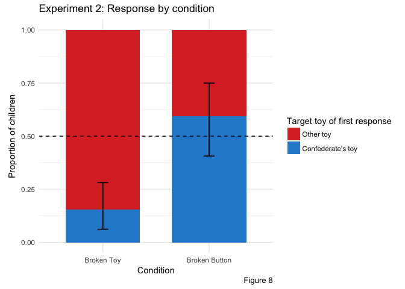
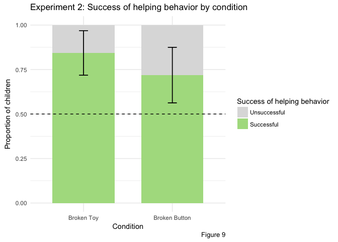
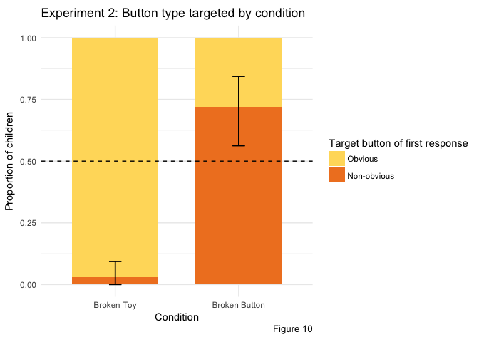
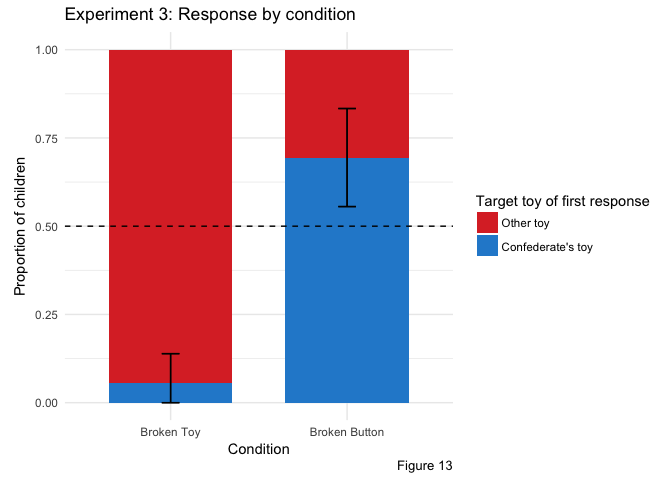
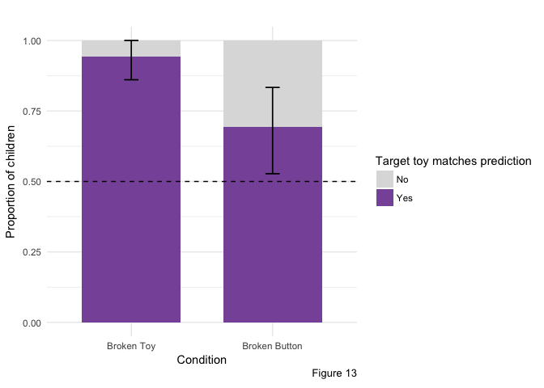
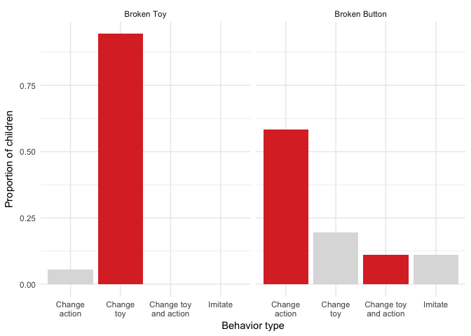

Untitled
================
Sara Altman
2/13/2018

Introduction---mostly notes at the moment
=========================================

Humans, both as adults and as children, routinely help others. Adults help strangers, family, and people in-between. They will hold open doors for people whose hands are full, cook food for people who are hungry, donate money to people who ask for it, and give directions to tourists. All these situations require us to think about the other person, as helping someone requires an understanding of what that her is, and what stands in the way of her achieving that goal (Warneken and Tomasello, 2006). Those goals can be action-based (i.e., opening a door), or more abstract (i.e., learning algebra), and the obstacles can stem from the person's own abilities (i.e., strength), from the physical world, or from other people. Helping is therefore a complicated cognitive skill. It requires an understanding that others have goals, the ability to determine, often from ambiguous evidence, what those goals are, and the understanding that various types of obstacles can prevent them from achieving those goals. Helping effectively also requires that you understand how to remove or alleviate the obstacles to your social partner's goals, which can require you to have prior experience with the situation (i.e., knowledge of algebra) or particular skills (i.e., atypical strength).

Helping involves the helper giving something to her social partner, but what they give will depend on the situation and the goals of the social partner. Helpers typically provide either goods, services, or information (Tomasello, 2009). These types of helping vary not only in the currency of the helping behavior, but also in the specific cognitive skills required to help effectively. Providing goods (i.e., a blanket if the social partner is cold) requires knowledge about what kinds of goods can fulfill various goods. Providing services requires the physical and cognitive abilities to perform those services. Helping situations involving sharing information are different from the other categories because they involve reasoning about what you know that your social partner does not. This may involve realizing that the social partner has a false belief, but can also involve realizing that the social partner is ignorant to some crucial piece of knowledge. It also does not necessarily involve verbally explaining the missing piece of information; 12-month-olds will, for example, point out the location of objects that an adult is looking for (Liszkowski, Carpenter, Striano, & Tomasello, 2006).

Much has been written about altruism in humans (Warnekan & Tomasello, 2009; Tomasello, 2009), but helping is not necessarily altruistic. Regardless of whether the helper is rewarded for her help, she had to harness the various cognitive skills discussed earlier. Therefore, the research discussed in this thesis investigates the cognitive skills involved in helping without dwelling on the exact motivations of the children involved. We wanted to know how children help when they are motivated, for whatever reason, to do so, and thus took various steps to motivate children to help.

\[...\]

Development of the motivation to help
-------------------------------------

By their second birthday, children willingly help others in a variety of contexts. Infants as young as 12 months will point to show others objects that they are looking for (Liszkowski et al., 2006). They are also sensitive to exactly what information others lack, and will selectively point out only the information that others need to fulfill their goals (Liszkowski, Carpenter, & Tomasello, 2008). At 18 months, children will reliably

The various cognitive skills discussed earlier are required for helping regardless of whehter or not the helper is also motivated by self-interest.

In the experiments that are the topic of this thesis,

Children spontaneously help others from a young age, and are able to distinguish, in simple cases, between circumstances in which their social partner needs help and circumstances in which she does not (Warnekan and Tomasello, 2006).

However, less is known about how the cognitive skills involved in helping develop.

Helping is a complicated skill that requires both sufficient motivation to help and various social-cognitive abilities that allow you to help effectively.

Much of the literature on prosocial behavior has focused on why and when humans help others, but helping is as much a complicated skill as it is a particular emotional stance toward your social partner. Being motivated to help someone is only half the battle. Helping really is not that helpful if it is ineffective, but we know that when adults and children help, they are often effectively helpful. They produce an action that helps us meet our goals.

1.  Development of the motivation to help

Humans are motivated to help from a relatively young age. During the first year of life, children will point out the location of an object someone is searching for, pick up dropped objects, and show others an easier way to use a toy (Liszkowski, Carpenter, Striano, & Tomasello, 2009; Warnekan & Tomasello, 2006).

There is evidence that children's propensity to help and the types of situations in which children will help changes during the second and third years of life. One-year-olds not only are less likely to help overall than two-year-olds, but also, in contrast to two-year-olds, do not help reliably in situations in which they are required to respond to a partner's emotional distress (Svetlova, Nichols, and Brownell, 2010). One-year-olds may also require more communication from their social partner in order to help than two-year-olds (Svetlova, Nichols, and Brownell). Increased requests for help and scaffolding from a social partner can also increase one-year-olds likeliness of helping (Svetlova, Nicholds, & Brownell; Spinrad & Stifter, 2006).

Familiarity also likely to influences the likelihood that a child will help. One-year-olds are more likely to respond proscially in familiar situations or when their social partner demonstrates a familiar emotion (Zahn-Waxler, Radke-Yarrow et al., 1992).

It is not clear why humans help others, or if humans ever behave truly altruistically (i.e., act for another )

Development between 1 and 2 - Svetlova, Nichols, and Brown 2010 - "at the end of the second year of life when toddlers' helping behavior expands to include empathic as well as instrumental helping" - 18 month olds helped instrumentally - "18-month-olds' helping required significantly greater communicative support and scaffolding from an adult than that of 30-month-olds, whose prosocial behavior was more autonomous and demonstrated greater social understanding." - "propensity of respond prosocially grows signficicantly between 18 and 30 months of age"

Svetlova, Nichols, and Brownell (2010) investigated the behavior of 18- and 30-month-olds in three different contexts: instrumental, empathic, and altruistic. The instrumental contexts required children to perform some action to help their social partner, the empathic contexts requried chidren to respond to their partner's emotional distress, and the altruistic contexts required children to incur a cost in order to help the partner. The 30-month-olds helped more often and more quickly than the 18-month-olds in all contexts, suggesting that the motivation to help continues to develop during the third year of life.

There is evidence that toddlers' propesnity to behave prosocially depends on context and prior social experience. - Svetlova, Nichols, and Brownell (2010) found that two-year-olds are more likely to help in instrumental or em

Svetlova, Nichols, and Brownell - Toddlers are more likely to respond positively to a peer's distress, for example, if they were responsible for the peer's distress (Demetriou and Hay, 2004). Furthermore, engaging in reciprocal play can lead 1- and 2-year-olds to be more likely to behave altruistically toward their social partner (Cortes Barragan and Dweck, 2014).

Todders may like helping - studies where they forgo reward, or seem to ignore cost - but maybe they just like helping and get enjoyment out of it

1.  Goal attribution early goal attribution

-   Infants as young as five months see an adult's repeated reach for an object as goal-directed (Woodward, 1998).
-   Will even attribute goals to inanimate objects with specific characteristics (Csibra, 2008)
-   thus the behavior of an agent is used to infer a goal
-   Meltzoff, 1995---infants can infer intentions for incomplete actions and do that action themselves
-   Possible that it's easier to understand someone's goal when you have experience with that type of thing yourself (Sommerville, Woodward, Needham, 2005)

Goal attribution often involves reasoning about someone's preference. - Spaepen and Spelke 2006 --- specifics about reaching studies - Kushnir, Xu, and Wellman (2010) --- infants consider statistical information when attributing a goal - Baillargeon, Scott, He, et al. (2014) --- lit review including stuff on goal attribution

1.  Helping in complex situations

-   Understanding who is the best person to ask for help (Paulus and Moore, 2011)
-   

Demetriou and Hay 2004 Hay 2006

Helping another person often involves providing information to that person that can help her accomplish her goals.

sometimes it is clear what information to provide. however, sometimes it is more complicated, and you have to decide what information or how much information the other person requires to fulfill her goal. - gricean maxims? - seems that children do take this into account - will adjust the amount of information they provide depending on someone else's goals

depends on goals - Knudsen Liszkowski 2012

and also the amount of knowledge the person already has

this often involves taking into account what knowledge that person already has - will point out information only if they think the person doesn't know it - amount of information provided will depend on the context that the person already has - Gweon, Shafto, Schulz 2014

-   helping often involves sharing information with another person. sometimes, it is clear what information to provide. but sometimes it's not, and we need to decide which peice of information best suites our social partner's goal.

children are willing to help from a young age - tomasello 2009

one year olds will help in straightforward situations in which there's really only one action to take - warnekan and tomasello 2006 - will do so in a variety of situations: cupboard door if hands are full, dropped marker - children are not only willing to help, but able to figure out what the adult wanted and provide assistance that helped him meet his goal - these situations are simple, and get at the motivation to help

older children are motivated to help and can figure out how to help in more complicated situations - this often involves reasoning about what the other person's goal is -- you need to figure out exactly what it is that they want - liszkowski carpenter and tomasello - buttleman, carpenter and tomasello +more

children can reason about these goals in relatively complex situations - martin and olson -- children will help an experimenter even if her verbal requests conflicted with the goal she wanted to fulfill

these studies involve children having to figure out what the other person's goal is, and then they use that explain why our task is more complicated than much of the literature just talked about - children have to recall knowledge about the toys, take that knoweldge and the result of the confederate's action into account, then think about how to address the source of her failure in order to meet her goal

more complex process that requires integrating many sources of information

as adults, we often engage in this type of helping. - for example, if we see someone struggling to project slides, have to reason about what they want (project slides? learn how the system works? play audio from their laptop?). we then have to use prior knowledge about the system to infer what they are doing wrong from their actions (wrong cord? laptop broken?). we then also need to be motivated to help (do we want this person to succeed? do we like helping? are we confident enough in our knowledge to help them?)

Previous work by Gweon and Schulz (2011) suggests that children as young as 16 months are capable of inferring the causes of their *own* failed actions and helping themselves accordingly. In the study, children either witnessed that a toy sometimes worked and sometimes did not, regardless of who operated the toy, or that the toy worked for some agents but not others. Children were then given the opportunity to try the toys for themselves, but the toys never activated. Children who witnessed that toy functionality did not depend on the agent were more likely to reach for a new toy, suggesting that they attributed their failure to the toy itself. In contrast, children who witnessed that toy functionality did depend on the agent were more likely to hand the toy off to their parent. This suggests that they attributed their failure to themselves, and thus needed someone else to operate the toy in order to make it activate.

frame as "responding" instead of helping?

two interpretations - children are helping the confederate achieve a goal - children are figuring out why she is failing and then producing music - this then makes it more like

even if we go with the second, can disucss as sort of a "precursor" to the first---indicate taht teh reasoning is there even if the motivation is not

developmental trends - 2 year olds more likely to help when adult is very clear about goal (pointing, asking) - brownell svetlova nichols 2009 - svetlova, nichols, brownell 2010 - so motivation exists but still developing ability to figure out what someone's goals are from more subtle cues

Experiment 1
============

We presented children with a situation in which there were multiple ways to help another person. We manipulated the likely cause of the person in need of help's failure, which made one course of action more helpful than another.

Methods
-------

### Participants

\[need check that the exclude codes are right--some of the counts are different than ones in cogsci paper\]

We recruited fifty-two 24- to 48-month-olds (M(SD) = 2.78(0.48)yrs, 44% female) from a museum in Palo Alto, CA. An additional 18 children were excluded from analysis due to parental interference (n = 9), experimenter error (n = 3), shyness (n = 3), or lack of video recording (n = 3). We randomly assigned children to one of two conditions: the Broken Toy condition (n = 26; M(SD) = 2.78(0.54)yrs) or the Broken Button condition (n = 26; M(SD) = 2.78(0.43)yrs).

### Stimuli

We constructed three identical-looking toys. One side of each toy was covered in yellow felt and had a yellow button in the center. The opposite side was covered in red felt and had a red button in the center. The yellow button on two toys played music, while the yellow button on the third toy was inert. All red buttons were inert. The toys were placed on a white plastic tray and covered with grey felt. See Figure 2 for a schematic of the toys.

### Procedure

The experiment began with a *warm-up phase* in which a confederate and experimenter engaged the child in reciprocal games (e.g., rolling a ball back and forth through a tube) in order to help the child feel comfortable with the researchers, and promote general helping behavior (see Cortes Barragan & Dweck, 2014). After approximately 5 minutes of warm-up, the confederate excused herself from the room, explaining that she had work to do.

Then, the child gained experience with the toys during the *play phase*. The experimenter behaved as if she were exploring the toys for the first time. She took one toy out at a time and showed it to the child. In the Broken Toy condition, the toys were oriented such that the yellow side was on top. She noticed the yellow button, pressed it, and reacted positively to the music that played. She also encouraged the child to press the yellow button and again reacted positively, saying, “Music! The yellow side plays music!”. She then turned the toy around in her hands until she discovered the red button on the opposite side, and expressed mild surprise, as if she did not expect it to be there. She pressed the red button and also encouraged the child to do so, acting perplexed and disappointed that it did not play music. The experimenter then took the second toy out, which she and the child explored in the same way (i.e., the experimenter pressed each button, and then encouraged the child to do so). This second toy was always the broken toy. This process was repeated with the third toy, which functioned the same as the first (i.e., the yellow button played music, but the red button did nothing). The child and experimenter then explored each toy again, taking turns pressing the buttons. The Broken Button condition proceeded identically except that the toys were placed with the red side up, such that the red button was discovered first, and then the yellow. By the end of the play phase, all children experienced that pressing the yellow buttons on two of the toys played music (and one was inert), and that none of the red buttons played music. See Figure 1 for a schematic of the play phase.

In the helping phase, the experimenter placed toys back on the tray and covered them with the felt. The toys were placed as they were during the play phase: yellow-side-up in the Broken Toy condition, and red-side-up in the Broken Button condition. The child sat approximately 6 ft away from the tray, either by him-/herself or with a parent. The experimenter then called the confederate back into the room and explained that she and the child were playing with toys that played music. The confederate said, “I love music!” and knelt down behind the tray, facing the child. She appeared to think about which toy to select, then said, "Hmm, I think I'll play with this one!" She then took a toy out from behind the felt such that the child could not see from where on the tray the toy was selected. She placed her chosen toy in front of her and moved the tray containing the remaining two toys, covered by felt, off to one side (counterbalanced).

She then pressed the button on top of her chosen toy (the yellow button in the Broken Toy condition; the red button in the Broken Button condition). The toy did not play music. The confederate remarked, “Hmm, no music!” and pressed the button again, expressing disappointment and saying, “Still no music! I really want to play music!” She then put one hand on the tray, and at the same time, slid her toy with the other hand such that it was parallel with the tray but on her opposite side. Once the toy and tray were equidistant from the confederate, she removed her hand from the toy and removed the felt from the tray to reveal the two other toys. She then gestured to both the toy and the tray and asked, “Can you help me play music?” The toy and tray were far enough apart (approximately 2 ft) and from the child (approximately 5 ft) that s/he could not approach both simultaneously.

If the child did not respond, the confederate and experimenter provided planned prompts, waiting 5 seconds in between, until the child responded. The last of these prompts involved the confederate moving closer to the child (approx. 2 ft.) and placing the tray and the toy within the child’s reach but still far enough apart that the child could only reach to one location at a time.

Thus, the only differences across condiitions involved what color button the child perceived as the bottom or hidden buttons. In the Broken Toy condition, the experimenter presented the yellow button of each toy to the child first, then revealed the non-obvious red button. The toys were still oriented this way when the confederate came in, chose her toy, and acted upon the toy. In the Broken Button condition, the experimenter presented the red, inert buttons first, and the red buttons were on top during the confederate's interaction with the toys.

We were interested in children’s first response after the confederate’s failure to activate her toy (i.e., her first button press). The key dependent measure was the target toy of this behavior, coded as either the “confederate’s toy” or the “toys on the tray”. All children who responded fell into one of these two categories.

We also looked at the consequence of children’s first helping responses. We coded whether the behavior was “successful" or “unsuccessful” in achieving the confederate’s goal of playing music. In the Broken Toy condition, we coded a child’s first response as “successful” if the child pressed the yellow button on a toy from the tray or directed the confederate to press it (e.g., telling her to do so, pointing, or handing her a toy yellow side up). “Unsuccessful” responses included pressing or directing the confederate to press the red button on any toy or the yellow button on the confederate’s toy. In the Broken Button condition, we coded a behavior as “successful” if a child flipped and pressed the yellow button or directed the confederate to do so (e.g., telling her to press it, flipping a toy and handing it to the confederate or pointing to a yellow side). Therefore, in the Broken Button condition, children could respond successfully regardless of which toy they targeted. In the Broken Toy condition, however, children could only respond successfully if they targeted the toys on the tray. A researcher blind to the hypotheses coded these transcriptions for reliability and agreement was 100%.

Results
=======

Children in both conditions saw the same set of toys and watched the confederate perform the same action (pressing an obvious button on the top of a toy, which subsequently did not play music). All children could then either approach the toy the confederate had just pressed or a toy on the tray. The conditions differed only in the likely source of the confederate's failure to play music. We manipulated the likely source of her failure by varying whether the button pressed by the confederate was the type of button that worked on a majority of the toys (i.e., a yellow button; Broken Toy condition) or the type of button that was always inert (i.e., a red button; Broken Button condition).

We predicted responses to vary across conditions depending on the source of the confederate’s failure. In the Broken Toy condition, the confederate presses a yellow button. From this action alone, you can infer that she has the inert toy, since yellow buttons produce music on all toys except one. The source of her failure is therefore the toy itself. Her action (pressing a yellow button) would have produced music if she had chosen another toy. The child can thus only help the confederate achieve her goal of playing music by targeting a new toy from the tray.

In the Broken Button condition, however, it is only possible to infer that the confederate is taking the wrong action on a toy (i.e., pressing a red button instead of a yellow one). Each toy has an inert red button, so the confederate's action provides no information about which type of toy (functional or inert) she has chosen. Therefore, in this condition, children could help the confederate by approaching her toy, as toy may have a functional yellow button on the bottom. We thus predicted that more children would approach the “toys on the tray” in the Broken Toy condition than in the Broken Button condition. As predicted, children were significantly more likely to direct their help toward a toy on the tray in the Broken Toy condition than in the Broken Button condition (73% vs. 27%; two-tailed Fisher’s Exact Test, p = 0.002).

We then looked at children’s responses within each condition. In the Broken Toy condition, children could not help fulfill the confederate's goal of producing music by acting on the confederate's toy. We thus predicted that children in this condition would preferentially direct their help toward a toy on the tray. As predicted, children were more likely to approach the “toys on the tray” than the “confederate’s toy” (19/26; two-tailed binomial test, p = 0.029).

In the Broken Button condition, however, it is not clear which toy the confederate has chosen. There is a 33% chance that any toy is the inert toy, and thus all toys are equally likely to be capable of producing music. It is therefore reasonable to target any toy. However, there are several reasons to expect that children would prefer the confederate's toy in this condition. First, children may be inclined to approach the toy just acted upon by the confederate. Second, children may conclude that the confederate's goal is not just to play music, but to play music specifically with her chosen toy. Thus, we expected that children would show a mild preference for the confederate’s toy. The majority of children in the Broken Button condition did approach the "confederate's toy" (19/26; two-tailed binomial test, p = 0.029). See Figure 2 for a summary of children’s first responses.

As a secondary measure, we looked at the success of children's helping responses. We considered response successful if the child acted in way that could fulfill the confederate's goal of playing music. In the Broken Toy condition, a behavior could be successful only if it involved approaching the "toys on the tray." In the Broken Button condition, successful behaviors involved revealing a yellow button on any of the toys. It is plausible that helping successfully is more difficult in the Broken Button condition, as it involves revealing a non-obvious button. However, children can be helpful at either toy in the Broken Button condition and there are therefore more ways to offer successful help. All children in the Broken Button condition included in this analysis helped successfully (25/25). One child in the Broken Button condition was dropped from this analysis because the camera angle prevented visual access to the content of her helping behavior. Children in the Broken Button condition were more likely to help successfully than children in the Broken Button condition (73% in Broken Toy vs. 100% in Broken Button; two-tailed Fisher’s Exact Test, p = 0.01). Children tended to help successfully overall; within each condition, children were more likely to help successfully than unsuccessfully (Broken Toy: 19/26, two-tailed binomial test, p = 0.0289593; Broken Button: 25/25, two-tailed binomial test, p = 610^{-8}).

As an exploratory analysis, we coded children’s first responses as “correct” (Broken Toy: “toys on tray”; Broken Button: “confederate’s toy”) or “incorrect”. We fit a generalized linear model with correctness as the outcome variable, condition as a categorical predictor variable, and age as a continuous predictor variable. This analysis revealed that age is a significant predictor of "correctness" (*β* = 1.67, p = 0.03), but that condition is not (*β* = -0.08, p = 0.9). For details, see Table 5.

    ## [1] 5

| Term                    |  Estimate|    SE|  Z statistic|  p\_value|
|:------------------------|---------:|-----:|------------:|---------:|
| Intercept               |     -3.45|  2.07|        -1.67|      0.09|
| condition:Broken Button |     -0.08|  0.66|        -0.13|      0.90|
| Age                     |      1.67|  0.78|         2.13|      0.03|

\[note: im really note sure that this is helpful to include\]

As a second exploratory analysis, we investigated how often children targeted on a non-obvious (i.e., bottom) button as a second exploratory analysis. This is similar to the helpfulness analysis discussed previously in that we are interested in the content of children's helping behavior beyond which toy they choose to target. In the Broken Button condition, children who target a bottom button were also coded as "helpful" and thus the two codes are identical. However, in the Broken Toy condition, children can only be helpful if they target a top (i.e., yellow) button on a toy on the tray. Thus, children could be unhelpful in multiple ways. They could target a red button on a toy on the tray or confederate's toy, but they could also target the yellow button on the confederate's toy. The two codes are therefore not identical in this condition.

If children are responding effectively to the likely source of the confederate's failure, we should expect children in the Broken Button condition to be more likely to flip the toys over than children in the Broken Toy condition, as the toys in the Broken Toy condition are already oriented such that the functional buttons are on top. We found that were significantly more likely to target a non-obvious button in the Broken Button condition than in the Broken Toy condition (96% vs. 12%; two-tailed Fisher’s Exact Test, p &lt; 0.001). Furthermore, children in the Broken Button condition were significantly more likely to target a non-obvious button than an obvious button (25/26, two-tailed binomial test, p &lt; 0.001), while children in the Broken Toy condition were significantly more likely to target an obvious button than a non-obvious one (3/26, two-tailed binomial test, p &lt; 0.001).

### Discussion

These results suggest that 2- and 3-year-olds were able to use prior knowledge to infer the likely cause of another's failure and effective help that person achieve a goal. When the likely cause of the confederate's failure was the toy itself (Broken Toy condition), children helped by changing the toy, but when the likely cuase was the confederate's action on the toy (Broken Button condition), children helped by changing her action on that toy. Thus, children did not help in a uniform way across conditions; they responded to the likely cause of the confederate's failure.

The only way to address the source of the confederate's failure in the Broken Toy condition was to target a new toy. However, in the Broken Button condition, there were multiple ways to fulfill the confederate's goal. Children needed to correct her action, by showing her that she needed to act on a yellow button instead of a red one, but they could do so on either the confederate's own toy or on a new toy. Each toy was equally like to have a functional yellow button, but children in this condition were more likely to show the confederate the correct action on the toy that she had previously chosen. It is possible that children are more inclined to approach a toy upon which someone has already chosen to act. However, it is also possible that children thought that the confederate's goal was to play music with her chosen toy, rather than to play music generally.

Furthermore, the children in the Broken Button condition that targeted the toys on tray (7 / 26) all targeted a bottom button on a toy. This indicates that, even though they did change the toy, they did not think that her toy alone was the problem, as they changed the action taken on the toy in addition to the identity of the toy.

We did find an age-related trend in terms of "correctness." However, this does not necessarily suggest that 2-year-olds are less capable of performing this task than 3-year-olds. Instead, it is possible that 2-year-olds are more likely to help by targeting the toys on the tray in this condition, which, as explained earlier, is still helpful. 2-year-olds may have a stronger aversion to acting on a toy that someone has already failed to work, or may interpret the confederate's goal differently than 3-year-olds.

    ## # A tibble: 3 x 3
    ##   flip  firstChoice          nn
    ##   <lgl> <chr>             <int>
    ## 1 F     Confederate's toy     4
    ## 2 F     Other toy            19
    ## 3 T     Confederate's toy     3

Interestingly, none of children in the Broken Toy condition who successfully helped the confederate (i.e., targeted a yellow button on a toy on the tray) provided exhaustive information about the toys by also showing the confederate the non-obvious red buttons. This suggests that children noticed that the confederate's goal was only to play music---not to learn the full structure of the toys. Our finding is therefore consistent with prior research suggesting that 4- to 5-year-olds adjust the amount of information they provide to a social partner depending on whether her goal is learn how a toy works or to just see what the toy does (Gweon, Chu, & Schulz, 2014).

Our results suggest that 2- and 3-year-olds can infer the cause of someone's failed action and use that inference to help the person achieve her goal. However, the Broken Button condition does not actually require that chidlren infer the source of the confederate's failure. Because of how the toys are color-coded, the confederate's mistake is marked in red and all possible helpful actions are marked in yellow. Therefore, children in this condition could just remember that yellow produces music, instead of inferring that the confederate's action on the toy is the source of her failure. This is not the case, however, in the Broken Toy condition. Both the confederate's failed action and all helpful actions are marked in yellow. Children need to target a yellow button on a *new* toy and cannot simply target a particular color. To eliminate this alternative explanation in the Broken Button condition as well as the asymmetry between the two conditions, we designed a second experiment with two identical toys.

Experiment 2
============

Methods
-------

### Participants

We recruited 64 24- to 48-month-old participants (M(SD) = 3.03, 42% female) from a local preschool. An additional 11 children were excluded from analysis due to experimenter error (n = 2), the child responding too early (n = 4), the child having prior exposure to the experiment (n = 4), or lack of video recording (n = 1).

We randomly assigned children to one of two conditions: the Broken Toy condition (n = 32; M(SD) = 3.05(0.47)yrs) or the Broken Button condition (n = 32; M(SD) = 3(0.41)yrs).

### Stimuli

We constructed four toys, similar to those used in Experiment 1. Two opposite sides of each toy were covered in red felt and had a red button in the center. The others sides of the toys were covered in blue felt. Two of the toys were used in the Broken Toy condition and the other two were used in the Broken Button condition. The pair of toys used in the Broken Toy condition consisted of one toy with two buttons that played music when pressed. The other toy in this pair had two inert buttons. The two toys used in the Broken Button condition were identical. One button on each toy played music when pressed. The other button on each toy was inert. In each condition, the two toys were placed in a woven basket. See Figure 6 for a schematic of the toys.

### Procedure

As in Experiment 1, the experiment consisted of a *warm-up phase*, *play phase*, and *helping phase*. During the warm-up phase, the confederate engaged the child in the same reciprocal games as in Experiment 1. The warm-up phase lasted approximately three minutes. This was two minutes shorter than the warm-up phase in Experiment 1 because the children in this experiment were already familiar with the experimenter and room in which the experiment was held.

During the play phase, the experimenter and the child interacted with two of the four toys. The experimenter behaved in a manner similar to that of Experiment 1. In contrast to Experiment 1, however, children saw different sets of toys in each condition. The child engaged with the fully inert toy and the fully functional toy in the Broken Toy condition. In the Wrong Action condition, the child engaged with the two identical toys that each had one functional button and one inert button.

The play phase began with the two toys in the woven basket. The experimenter took one toy out of the basket. She remarked that it had a blue bottom on the top and pushed the button. In both conditions, this first button played music. The experimenter reacted positively to the music and said, "Music! It plays music!" She then asked the child if s/he would like to try and encouraged him/her to push the button. After the child pressed the button, the experimener said, "Music! It plays music! This side plays music."

The experimenter then wondered aloud if the toy could do anything else, while turning the toy over in her hands. Upon finding the bottom button, the confederate acted mildly surprised and remarked that the toy had a blue button on the bottom. She then pressed the button. In the Broken Toy condition, this button played music. She reacted as she had to the top button, encouraged the child to press the button, then said, "Music! It plays music! This side plays music. So this toy plays music." In the Broken Button condition, however, the bottom button on the first toy did not play music. The experimenter remarked, "Nothing! No music," and shook her head while she spoke. She then encouraged the child to push the button. After the child had done so, she said, "Nothing! No music! This side does not play music. So only this side plays music," pointing to the functional side of the toy. She then placed the toy to the side and removed the second toy from the basket. In the Broken Toy condition, this toy was the inert toy. In the Broken Button condition, the inert button was on the top. The experimenter again remarked that the toy had a blue button on top. She pressed the button and it did nothing. She reacted as described previously (commenting that it did not play music, summarising that the side did not play music after the child had pressed the button). The experimenter discovered the bottom button of the toy as she had with the first toy. In the Broken Toy condition, this button was also inert and the confederate acted as just described. In the Broken Button condition, this button was functional. The confederate acted as she had when the button on the first toy had played music. Thus, by the end of the play phase, all children had either experienced that one toy had two functional buttons and one had two inert buttons (Broken Toy) or that each toy had one functional and one inert button (Broken Button).

In the helping phase, the experimenter returned the toys to the basket before placing the toys approximately 4 feet in front of the child and 4 feet 6 inches apart from each other. The midpoint between the two toys was directly in front of the child so that the child was equidistant from each toy. In the Broken Button condition, both toys were oriented so that the inert button was on top. As in Experiment 1, the experimenter called the confederate back into the room and explained that she and the child were playing with toys that played music. The confederate responded, "I love music!" and stood 2 feet behind the toys such that she was equidistant from each toy. She glanced at each toy, then fixed her gaze on one (side counterbalanced) and said, "Hmm, I think I'll play with this one." She knelt behind her chosen toy and pressed the top button, which did not play music. As in Experiment 1, she remarked, "Hmm, no music!" and then pressed it again and said, "Still no music!" She then returned, still kneeling, to the spot X feet behind the toys equidistant from each and said, "I really want music! Can you show me?" while gesturing to each toy simultaneously.

If the child did not respond, the confederate and experimenter provided additional prompts as in Experiment 1 until the child responded or the last prompt was given. Before giving the final prompt, the confederate picked up both toys and brought them closer, but still out of reach, of the child.

If the child provided help that did not involve a physical demonstration (i.e., pointed or gave verbal instructions) before the confederate moved back to the center and gave her prompt, the confederate indicated that she had noticed the help by saying, "Ooh," moved back to the center, and said, "Can you show me?" If the child did not respond, the experimenter and confederate continued prompting as explained above.

As in Experiment 1, the key dependent measure was the target of the child's first response after the confederate's failure. We coded the target as either the toy that the confederate had acted upon ("confederate's toy") or the other toy that she had not touched ("other toy"). All children included in this experiment fell into one of these two categories.

The consequence of each child's first response was also coded. We coded a response as "successful" if the behavior helped the confederate play music, and "unsuccessful" otherwise. In the Broken Toy condition, we coded a response as "successful" if the child pressed a button on the other toy or indicated (by pointing or verbally instructing) that the confederate should do so. We coded a response as "unsuccesful" if the target of the child's first behavior was the confederate's toy. In the Broken button condition, we coded a response as "successful" if the child flipped and pressed the bottom button on either of the two toys, or indicated (by pointing or verbally instructing) that the confederate should flip and press a bottom button. Unsuccessful behaviors involved acting on a top button or indicating that the confederate should act on a top button.

Results
=======

To verify that children did not express a side bias or preference for any confederate or experimenter, we ran a logistic regression with "correctness" of response as the outcome and toy side, experimenter identity, and confederate identity as predictors. None were signficant predictors of correctness. See Table 7 for details.

| Term                   |  Estimate|    SE|  Z statistic|  p-value|
|:-----------------------|---------:|-----:|------------:|--------:|
| Intercept              |      2.53|  1.69|         1.50|     0.13|
| toySideR               |      0.20|  0.61|         0.33|     0.74|
| experimenterSara       |     -0.40|  1.31|        -0.31|     0.76|
| experimenterSophie     |     -1.15|  1.50|        -0.77|     0.44|
| confederateGrace       |     -1.06|  1.20|        -0.89|     0.37|
| confederateHuda        |     -1.71|  1.43|        -1.20|     0.23|
| confederateMaria Marta |     -1.22|  1.46|        -0.83|     0.41|
| confederateSara        |     -0.07|  1.51|        -0.05|     0.96|
| confederateSophie      |     -1.61|  1.27|        -1.27|     0.21|

Children in each condition saw identical-looking toys and watched the confederate perform the same set of actions. We manipulated the cause of the confederate's failure by varying the functionality of the toy chosen by the confederate. In the Broken Toy condition, one toy is fully inert and one plays music. Thus, the confederate is not operating her toy incorrectly-she has chosen a broken toy. The source of her failure is her choice of toy. However, in the Broken Button condition, each toy is capable of making music. The confederate did not choose the wrong toy since both toys are identical. Instead, her failure is due to her incorrect operation of her chosen toy.

We predicted responses to vary across conditions depending on the source of the confederate's failure. In the Broken Toy condition, it is only possible to effectively help the confederate play music by targeting the other toy. In the Broken Button condition, however, the toys are identical. Each toy has one functional button and one inert button. Once the confederate presses the top button on her toy, you can infer that the bottom button will be functional. It is therefore possible to help her by targeting her own toy (the "confederate's toy"). However, the "other toy" also has a functional button. Targeting this toy can then also address the confederate's goal of playing music. Because children in this condition could help the confederate by targeting at either toy, but children in the Broken Toy condition could help only by targeting the other toy, we predicted that children would be more likely to target the "other toy" in the Broken Toy condition than in the Broken Button condition. As predicted, children were significantly more likely to direct their help toward the "other toy" in the Broken Toy condition than in the Broken Button condition (84% % vs. 41%; two-tailed Fisher’s Exact Test, p = 610^{-4}). This replicates the finding from Experiment 1, and suggests that the red and yellow visual markers from Experiment 1 are not necessarily in order to observe responses that vary depending on the source of failure.

We also looked at responses within each condition. As predicted, children in the Broken Toy condition were more likely to target the "other toy" than the "confederate's toy" (27/32; two-tailed binomial test, p &lt; 0.001). Therefore, children appear to be reasoning that the confederate has the inert toy based on the her actions and their prior knowledge about the functionality of the two toys.

We did not have a directed prediction for the Broken Button condition because, as described earlier, targeting either toy can be helpful. Children in the Broken Button condition showed no preference for either toy (13/32; two-tailed binomial test, p = 0.377).

Again, as a secondary measure, we looked at the success of children's helping behaviors. Successful behaviors again included only those that aided the confederate in her goal of playing music. In the Broken Toy condition, children could successfully help only if they targeted the other toy. In the Broken Button condition, children could successfully help if they targeted the bottom button on either toy. We found no difference in the success of helping behavior across the two conditions (84% in Broken Toy vs. 72 in Broken Button; two-tailed Fisher’s Exact Test, p = 0.365). We then collapsed across conditions and found that children were more likely to successfully help than to unsuccessfully help (50/64; two-tailed binomial test, p &lt; 0.001). Thus, not only were children varying their responses based on the source of the confederate's failure, they targeted their responses in a way that could help fulfill her goal of playing music.

As another secondary analysis, we investigated how often children in each condition exhibited the "correct" response. In the Broken Toy condition, "correct" responses are those that target the other toy. In the Broken Button condition, "correct" responses are those that target the confederate's toy. We found no significant difference across conditions (84% in Broken Toy vs. 59% in Broken Button; two-tailed Fisher’s Exact Test, p = 0.05). We then collapsed across conditions to test if children were more likely to respond "correctly" or "incorrectly" versus the alternative. Children were more likely to respond "correctly" than "incorrectly" (46/64; two-tailed binomial test, p &lt; 0.001)

Finally, as an exploratory measure, we again looked at how often children targeted a non-obvious, bottom button. Children in the Broken Button condition were significantly more likely to target a bottom button than in the Broken Toy coniditon (72% vs. 3%; two-tailed Fisher's exact test, p &lt; 0.001), indicating that children were using prior knowledge about the toys' functionality when responding to the confederate. Children were also more likely to target a non-obvious bottom button than an obvious top button in the Broken Button condition (23/32; two-tailed binomial test, p = 0.02) and children in the Broken Toy condition were more likely to target an obvious button than a non-obvious button (1/32; two-tailed binomial test, p &lt; 0.001).

Discussion
==========

In this experiment, 2- and 3-year-old children were again able to infer the likely cause of another's failure and offer appropriate help. We replicated our main finding from Experiment 1---children's responses varied with the likely cause of the confederate's failure.

However, children showed no preference for either toy in the Broken Button condition, in contrast to Experiment 1, in which they showed a preference for the confederate's toy. There are several reasons why we might expect children to target the confederate's toy in this condition. First, children have more information about the confederate's toy and should choose the confederate's toy if they wish to maximize the probability of producing music on a single button push. Children witnessed the confederate press a button on the top of her toy and the toy fail to activate. If a child remembered how the toys worked, she could then infer that the bottom button on the confederate's toy must be the functional button. They have no such information about other toy. In this experiment, the functional and non-functional sides are not marked and it is therefore not clear which button will produce music on the other toy. Therefore, if children want to maximize the chance of producing music, it makes sense to target the bottom button on the confederate's toy. Second, the confederate chooses one toy over another, by both verbally by remarking, "Hmm, I think I'll play with this one," and by kneeling down behind her chosen toy and pressing a button on that toy only. It therefore is reasonable to conclude that these actions indicate that she has a preference for one toy over another.

Here, we discuss several possible explanations of why children in the Broken Button condition demonstrated no preference for either toy.

It is possible that some children in the Broken Button condition forgot which toy was the confederate's toy. In Experiment 1, it was more obvious which toy was the confederate's toy because it was the only toy not on the tray. Although children in the Broken Toy condition appeared not to forget which toy was which, it is possible that the difference between the two toys was more salient in the Broken Toy condition because the toys were also functionally distinct.

A related explanation is that children interpreted the confederate's actions as her choosing randomly between two identical toys, and not as an expression of her preference for one toy over another. Thus, her goal was not to play music with her chosen toy (a *specific* goal), but instead to play music generally (a *general* goal). It then fulfills her goal to play music on either toy. Furthermore, the confederate's only verbal statement of her goal comes when she says, "I really want music!" and when she prompts the child to "show her", she gestures towards both toys. Therefore, during the period in which the confederate explicitly states her goal and prompts the child, she does not express a preference for either toy. She expressed her preference earlier, when she tried the toy, but perhaps children see her subsequent behavior as overriding this preference and thus think that she holds the general goal. The predicted behavior of children in the Broken Toy condition is the same regardless of which goal the children thought the confederate held, as you can only produce music on the other toy.

Note that it is also possible to be helpful at either toy even if the confederate holds the *specific* goal. Since the toys are identical, showing the confederate how to produce music on one toy can also inform the confederate how to produce music on her toy. It is possible that some children attributed the specific goal to the confederate and decided to inform her how to operate her own toy on the other toy.

\[what do children do at the other toy?\]

It is also possible that some children thought the confederate preferred her own toy, but had an aversion to the confederate's toy.

Of the 13 children in the Broken Button condition who targeted the other toy, only 5 flipped or indicated that the confederate should flip the toy over. These children were therefore included in the unsuccessfully helpful category. However, the children did not know which button was on top, and so probably tried the obvious one first to see if it would work. When it did not produce music, 11/13 of these children tried again, mostly (10/11) by flipping over the other toy. Thus, even though children who targeted the top button on the other toy were counted as unhelpful, they were able to integrate prior knowledge about how the toys worked and respond appropriately to their own failure.

Regardless of which goal the confederate holds, children could help the most efficiently by turning over the confederate's toy and pressing the bottom button, as the bottom button on the confederate's toy is guaranteed to play music, whereas either button on the other toy only has a 50% chance of playing music. It is possible that children are not taking this information into account when decididing how to help, either because they do not realize which button has the highest probability of producing music or because, while motivated to help, they are not motivated to help as efficiently as possible.

There were also 25 children who offered help after the confederate pressed the top button on her chosen toy, but before she moved back to the center and asked the child to "show her." These children exhibited similar responses as did children who responded after the confederate gave her prompt. These children spontaneously helped and did not require the confederate to either state or goal or to prompt the child to "show her." Thus, they were motivated to inform the confederate about how the toys worked even though they were not explicitly asked to do so. About half of these children also helped from where they were sitting, without getting up to operate a toy themselves (13 / 25), suggesting that they were informing the confederate about the toys, and not motivated solely by the desire to produce music themselves as soon as they saw the confederate fail to do so.

    It is possible that a combination of these explanations are occurring---i.e., some children are attributing the general goal to the confederate, some are attributing the specific goal, some forget which toy she acted upon, some are aversed to acting on the confederate's toy. It is also possible that multiple of these are in effect in one child. For example, a child could attribute the specific goal to the confederate and also have an aversion to the confederate's toy. 

    Thus, it is unclear what children thought of confederate's goal in this experiment, and subsequently why children in the Broken Button condition demonstrated no preference for either toy. In a third experiment, we made it clearer that the confederate's goal wasto play with her chosen toy, as well as eliminated the possibility of demonstrating how to operate one toy by acting on another. 

maybe insert something about how in the broken toy condition children override the confederate's preference and cite that paternalism article.

Experiment 3
============

In the third experiment, we changed the structure of one toy in each pair to make the toys visually and functionally distinct. This eliminated the possibility of demonstrating how to operate the confederate's toy by acting on the other toy. Additionally, when the confederate makes a choice between the two toys, it is now likelier that she is indicating her preference for one toy type over another, and thus likelier that she holds the specific goal.

Methods
-------

### Participants

We recruited 72 24- to 48-month-old participants (M(SD) = 2.96(0.52), 47% female). Of these children, 37 (M(SD) = 2.88(0.46)) were recruited from a museum in Palo Alto, CA and 35 of these participants (M(SD) = 3.04(0.56)) were recruited from a local preschool. An additional 19 children were excluded from analysis due to experimenter error (n = 1), parental or sibling interference (n = 4), the child responding too early (n = 7), the child having prior exposure to the experiment (n = 1), or lack of video recording (n = 1).

We randomly assigned children to one of two conditions: the Broken Toy condition (n = 36; M(SD) = 2.98(0.48)yrs) or the Broken Button condition (n = 36; M(SD) = 2.94(0.55)yrs).

### Stimuli

We constructed three pairs of toys. One toy in each pair looked identical to the toys constructed in Experiment 2 (*top-bottom toys*). The other three toys had a button on the top and on an adjacent side (*top-side toys*), instead of on the top and bottom, but were otherwise identical to the toys in Experiment 2. The toys in one pair each had one functional button and one inert button. For the other two pairs of toys, one toy had two functional buttons and the other had two inert buttons. In one of these pairs, the functional toy was a top-bottom toy; in the other pair, the functional toy was a top-side toy. See Figure 12.

### Procedure

Again, the experiment consisted of a warm-up phase, play phase, and helping phase. The warm-up phase was identical to the warm-up phase in Experiment 2.

The play phase was also identical to the play phase in Experiment 2, except that each child saw one top-side toy and one top-bottom toy. Children were again assigned to either the Broken Button or Broken Toy condition. Each child in the Broken Button condition played two toys that each had one functional button and one inert button. Half of children in the Broken Toy condition played with a functional top-side toy and an inert top-bottom toy, and half played with a functional top-bottom toy and an inert top-side toy.

The helping phase was identical to the helping phase in Experiment 2, except for the presence of one top-side toy. The experiment placed the top-side toys such that one button was on top and the other button faced the child. In the Broken Button condition, the top button was inert and the side button was functional. The helping phase then proceeded identically to the helping phase in Experiment 2.

Again, we coded the target of each child's first behavior after the confederate's failure (i.e., her first button press). This target was either the confederate's toy or the other toy, and all children who responded fell into one of these two categories. As in the previous two experiments, we also coded responses as successful or unsuccessful. The criteria were the same as in Experiment 2 for both conditions.

Results
=======

To verify that children did not express a bias for a particular toy type, side, confederate, or experimenter, we ran a logistic regression with all of the listed variables as predictors and an indicator variable representing whether or not children repsonded as predicted (i.e., targeted the confederate's toy in Broken Button or other toy in Broken Toy) as the response. None of the predictors were significant. See Table 2 for details.

| Term                |  Estimate|       SE|  Z statistic|  p-value|
|:--------------------|---------:|--------:|------------:|--------:|
| Intercept           |     32.71|  5464.61|         0.01|     1.00|
| toySideR            |      0.26|     0.65|         0.40|     0.69|
| toyTypetop-side     |      0.71|     0.69|         1.03|     0.30|
| experimenterSara    |    -14.95|  2870.19|        -0.01|     1.00|
| experimenterSophie  |     17.41|  2870.19|         0.01|     1.00|
| confederateFernanda |    -17.01|  4650.16|         0.00|     1.00|
| confederateGrace    |    -17.20|  4650.16|         0.00|     1.00|
| confederateNatalie  |    -16.75|  4650.16|         0.00|     1.00|
| confederateSara     |    -33.19|  5464.61|        -0.01|     1.00|
| confederateSophie   |    -16.34|  4650.16|         0.00|     1.00|

Again, we predicted that responses would vary across conditions depending on the source of the confederate's failure, and that children in the Broken Toy condition would be more likely to target the "other toy" than children in the Broken Button condition. As predicted, children were significantly more likely to direct their help toward the "other toy" in the Broken Toy condition than in the Broken Button condition (94% vs. 31%; two-tailed Fisher’s Exact Test, p &lt; 0.001). This replicates the findings in Experiment 1 and 2.

As in the previous two experiments, we also predicted and found that children within the Broken Toy condition would be more likely to target the "other toy" than the "confederate's toy" (34/36; two-tailed binomial test, p &lt; 0.001).

In contrast to Experiment 2, we predicted that children within the Broken Button condition would preferentially target the "confederate's toy" over the "other toy." The two toys in this experiment are visually different. Therefore, in the Broken Button condition, children can no longer effectively help the confederate by demonstrating the correct action on the "other toy." Additionally, because the toys are visually distinct, it now appears more likely that the confederate expresses a preference for one type of toy over the other when she selects a toy to operate. If children interpret her choice as a preference for her chosen type of toy, then they may also think it is more likely that she holds the "specific" goal of playing music with her chosen toy, and not the "general" goal of playing music with either toy. As predicted, children in this condition were more likely to target the "confederate's toy" than the "other toy" (11/36; two-tailed binomial test, p = 0.029).

As a secondary analysis, we investigated whether the proportion of children who behaved as predicted differed across conditions. Again, children in the Broken Toy condition behaved as predicted if they targeted the other toy. Children in the Broken Button condition behaved as predicted if they targeted the confederate's toy. Children were significantly more likely to behave as predicted in the Broken Toy condition than in the Broken Button condition (94% vs. 69%; two-tailed Fisher’s Exact Test, p = 0.012).

Since we found a signficant difference across conditions, we then looked at children's tendencies to behave as predicted within each condition. These analyses are identical to the analyses run to test our predictions about response within each condition. Thus, both children in the Broken Toy condition and Broken Button condition were significantly more likely to behave as predicted than not.

As another secondary analysis, we again looked at the proportion of children who were helped successfully. Children could successfully help in the Broken Toy condition if they targeted the other toy. Children could successfully help in the Broken Button condition if they targeted the non-obvious (i.e., either the bottom or side) button of either the confederate's toy or the other toy. We found that children in the Broken Toy condition were significantly more likely to help successfully than children in the Broken Button condition (94% vs. 31%; two-tailed Fisher’s Exact Test, p = 0.046). Children in the Broken Toy condition were significantly more likely to help successfully than to help unsuccessfully (34/36; two-tailed binomial test, p &lt; 0.001). Children in the Broken Button condition were also significantly more likely to help successfully than to unsuccessfully (27/36; two-tailed binomial test, p = 0.004).

Finally, as an exploratory analysis, we looked at the tendency of children to target the non-obvious button on a toy. In this experiment, a non-obvious button could be a bottom or side button. Children were significantly more likely to target a non-obvious button in the Broken Button condition than in the Broken Toy condition (69% % vs. 69%; two-tailed Fisher’s Exact Test, p &lt; 0.001). Furthermore, children in the Broken Button condition were significantly more likely to target a non-obvious button than an obvious button (25/36; two-tailed binomial test, p = 0.029). Children in the Broken Toy condition were significantly more likely to target an obvious button than a non-obvious button (2/36; two-tailed binomial test, p &lt; 0.001).

Discussion
==========

The results from this experiment again replicate our main finding from Experiment 1 that children's responses to the confederate's request vary depending on the likely source of her failure.

In contrast to the previous experiment, children in the Broken Button condition preferentially targeted the confederate's toy. The results of this experiment cannot disentangle the various explanations for the behavior of children in the Broken Button condition in Experiment 2. However, they do indicate that children are likely attributing the specific goal to the confederate in this experiment, and thus are sensitive to information about the confederate's goal.

In the Broken Toy condition, children still preferentially target the other toy, even though the toys are now visually distinct. This indicates that children are still willing to override the confederate's choice of toy if they realize her choice is incompatible with her goal, even though her actions make it likely that she has a preference for one toy type over another.

General Discussion
==================

In all three experiments, children responded differently depending on the likely source of the confederate's failure. This suggests that 2- and 3-year-olds can recruit prior knowledge to reason about the likely cause of another's failure and to effectively help.

COMMENTS TO SELF
================

ARE CHILDREN REALLY HELPING?
----------------------------

It is possible to argue that children are not really helping the confederate. Here, we address two possible counterarguments. First, it seems possible that children are behaving in the observed manner because they want to play music for themselves and are not really considering what the confederate wants. Most of the observed behavior discussed so far is consistent with this idea. If children want to play music for themselves, they would operate the other toy in the Broken Toy conditon. In the Broken Button condition, it makes the most sense to flip over the confederate's toy because children know the bottom or side button plays music (if they remember how the toys work). This does not, however, explain why children in the Broken Button condition in Experiment 2 showed no preference for either toy. One could argue that, because the toys were visually and functionally identical, children tended to forget which toy was which, or that they assumed the toys were oriented in the same direction. However, as argued earlier, we do not find either of these arguments very convincing, and instead argue that the observed differences in behavior between Experiment 2 and Experiment 3 are evidence that children are considering the confederate's goals when helping. Very little changes between Experiment 2 and Experiment 3 besides the appearance of the toys, but children in the Broken Button condition in Experiement 2 show no preference for either toy, while children in the same condition in Experiment 3 preferentially target the confederate's toy. The main difference between these two conditions is the appearance of the toys, but the appearance itself is unlikely to be the reason children prefer the confederate's toy, since we might then expect to see a similar pattern in the Broken Button condition. However, having visually distinct toys seems to change what the confederate's goal is, or at least limits the ways in which you can help her achieve her goal. \[something about choosing between identical toys = no preference; choosing between different ones = preference\] Therefore, it appears as if children are attending to the subtle visual change and incorporating that information when reasoning about the confederate's goal. Children would not have a reason to do this if they just wanted to play music for themselves.

Second, we can look at the content of children's helping behaviors. This is a stronger argument for teh idea that children are acting for the confederate. \[insert social referencing stuff\]

Another possible counteragument to the idea that children are helping the confederate, however, is that children are just answering a prompt. The confederate asks the child, either to help her or to show her, after stating that she likes music. Although this is often how people ask for help, it could also be interpreted as a command to the child or as "**Can** (i.e., are you capable of) helping me play music?". Children may also be more used to adults giving them commands than asking them for help.

What's the difference between helping and answering a question? Sometimes helping involves answering a question. For example, if someone asks you to explain a concept from a class they are struggling in, we would tend to count that as helping. However, question answering is often not helping, such as when having a casual conversation or answering a question during a job interview. What's the difference between these two scenarios?
