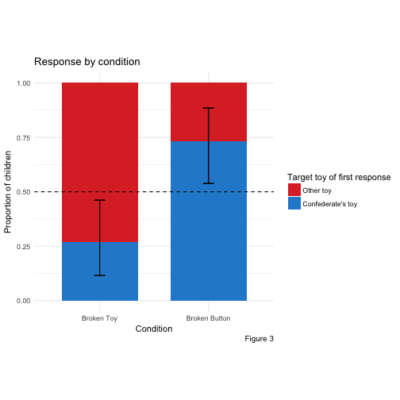
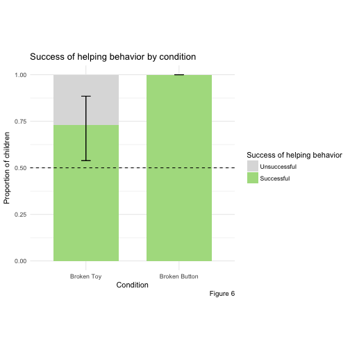

# Introduction

Humans are willing to help others from a relatively young age (*citation*)

# Experiment 1

We presented children with a situation in which there were multiple ways to help another person. We manipulated the likely cause of the person in need of help's failure, which made one course of action more helpful than another. 

## Methods

### Participants

We recruited fifty-two 24- to 48-month-olds (M(SD) = 2.78(0.48)yrs, 44% female) from a museum in Palo Alto, CA. An additional 18 children were excluded from analysis due to parental interference (n = 9), experimenter error (n = 3), shyness (n = 3), or lack of video recording (n = 3). We randomly assigned children to one of two conditions: the Broken Toy condition (n = 26; M(SD) = 2.78(0.54)yrs) or the Broken Button condition (n = 26; M(SD) = 2.78(0.43)yrs).

### Stimuli
We constructed three identical-looking toys. One side of each toy was covered in yellow felt and had a yellow button in the center. The opposite side was covered in red felt and had a red button in the center. The yellow button on two toys played music, while the yellow button on the third toy was inert. All red buttons were inert. The toys were placed on a white plastic tray and covered with grey felt. See Figure 1 for a schematic of the toys and procedure.

### Procedure
The experiment began with a *warm-up phase* in which a confederate and experimenter engaged the child in reciprocal games (e.g., rolling a ball back and forth through a tube) in order to help the child feel comfortable with the researchers, and promote general helping behavior (see Cortes Barragan & Dweck, 2014). After approximately 5 minutes of warm-up, the confederate excused herself from the room, explaining that she had work to do.

Then, the child gained experience with the toys during the *play phase*. The experimenter behaved as if she were exploring the toys for the first time. She took one toy out at a time and showed it to the child. In the Broken Toy condition, the toys were oriented such that the yellow side was on top. She noticed the yellow button, pressed it, and reacted positively to the music that played. She also encouraged the child to press the yellow button and again reacted positively, saying, “Music! The yellow side plays music!”. She then turned the toy around in her hands until she discovered the red button on the opposite side, and expressed mild surprise, as if she did not expect it to be there. She pressed the red button and also encouraged the child to do so, acting perplexed and disappointed that it did not play music. The experimenter then took the second toy out, which she and the child explored in the same way (i.e., the experimenter pressed each button, and then encouraged the child to do so). This second toy was always the broken toy. This process was repeated with the third toy, which functioned the same as the first (i.e., the yellow button played music, but the red button did nothing). The child and experimenter then explored each toy again, taking turns pressing the buttons. 

The Broken Button condition proceeded identically except that the toys were placed with the red side up, such that the red button was discovered first, and then the yellow. By the end of the play phase, all children experienced that pressing the yellow buttons on two of the toys played music (and one was inert), and that none of the red buttons played music.

In the helping phase, the experimenter placed toys back on the tray and covered them with the felt. The toys were placed as they were during the play phase: yellow-side-up in the Broken Toy condition, and red-side-up in the Broken Button condition. The child sat approximately 6 ft away from the tray, either by him-/herself or with a parent. The experimenter then called the confederate back into the room and explained that she and the child were playing with toys that played music. The confederate said, “I love music!” and knelt down behind the tray, facing the child. She appeared to select a toy at random from behind the felt; the child could not see which toy was chosen.

### Coding
We were interested in children’s first helping behavior after the confederate’s failure to activate her toy (i.e., her first button press). The key dependent measure was the target toy of this behavior, coded as either the “confederate’s toy” or the “toys on the tray”. All children who responded fell into one of these two categories.

We also looked at the consequence of children’s first helping responses. We coded whether their behavior was “successful or “unsuccessful” in achieving the confederate’s goal of playing music. In the Broken Toy condition, we coded a child’s first response as “successful” if the child pressed the yellow button on a toy from the tray or directed the confederate to press it (e.g., telling her to do so; handing or pointing to a toy yellow side up). “Unsuccessful” responses included pressing or directing the confederate to press the red button on any toy or the yellow button on the confederate’s toy. In the Wrong Action condition, a behavior was coded as “successful” if a child flipped and pressed the yellow button or directed the confederate to do so (e.g., telling her to press it, flipping a toy and handing or pointing to it yellow-side- up). Thus, in the Wrong Action condition, a behavior could be successful regardless of which toy a child’s first response targeted, whereas in the Broken Toy condition, only behavior directed toward the toys on the tray could be successful. The first and second author transcribed and coded children’s behavior and a researcher blind to the hypotheses coded these transcriptions for reliability and agreement was 100%.

# Results

Children in both conditions saw the same set of toys and watched the confederate perform the same action (pressing an obvious button on the top of a toy, which subsequently did not play music). All children could then either approach the toy the confederate had just pressed or a toy on the tray. The conditions differed in the likely source of the confederate's failure to play music, which we manipulated by varying whether the obvious button pressed by the confederate was the type of button that worked on a majority of the toys (i.e., a yellow button; Broken Toy condition) or the type of button that was always inert (i.e., a red button; Broken Button condition).  

We predicted responses to vary across conditions depending on the source of the confederate’s failure. In the Broken Toy condition, the source of the confederate's failure is likely the toy itself--since she presses a yellow button that works on all toys except one, she must have the inert toy. Therefore, the child can only help the confederate achieve her goal of playing music by targeting a new toy (a toy on the tray). In the Broken Button condition, however, the child can only infer that the confederate is pressing an inert buttton. Each toy has an inert red button, so the child cannot infer which toy (i.e., functional or non-functional) the confederate has chosen. Therefore, in this condition, children could help the confederate by approaching her toy, since the toy may have a functional yellow button on the bottom. We thus predicted that more children would approach the “toys on the tray” in the Broken Toy condition than in the Wrong Action condition. As predicted, children were significantly more likely to direct their help toward a toy on the tray in the Broken Toy condition than in the Wrong Action condition (73% vs. 27%; two-tailed Fisher’s Exact Test, p = 0.002).

We then looked at children’s responses within each condition. In the Broken Toy condition, no action on the confederate's toy could produce music and therefore help the confederate fulfill her goal. We thus predicted that children in this condition would preferentially direct their help toward a toy on the tray and, as predicted, children were more likely to approach the “toys on the tray” than the “confederate’s toy” (19/26; two-tailed binomial test, p = 0.029).

In the Broken Button condition, however, it is ambiguous whether or not the confederate has the fully inert toy. There is a 33% chance any toy the child flips over will have an inert yellow button. Since all toys are now equally likely to produce music, it is helpful for the child to target any toy. However, there are reasons to expect that children would prefer the confederate's toy in this condition. First, children may be inclined to approach the toy just acted upon by the confederate. Second, it is reasonable to conclude from the confederate's actions that she not only wants help playing music, but also that she wants help playing music specifically with her chosen toy. Thus, we expected that children might show a mild preference for the confederate’s toy. The majority of children in the Broken Button condition did approach the "confederate's toy" (13/26; two-tailed binomial test, p = 0.029). See Figure 2 for a summary of children’s first responses.

As a secondary measure of interest, we looked at the success of children's helping responses. We considered responses successful if they helped the confederate produce music. In the Broken Toy condition, a behavior could be successful only if it involved approaching the "toys on the tray." In the Broken Button condition, successful behaviors involved revealing a bottom button on any of the toys. Therefore, it is plausible that helping successfully is more difficult in the Broken Button condition than in the Broken Toy condition. However, we found no difference in success of helping behavior across the two conditions (73% in Broken Toy vs. 100 in Broken Button; two-tailed Fisher’s Exact Test, p = 0.0098). Children within each condition were also more likely to help successfully than unsuccessfully (Broken Toy: 19/26; Broken Button: 25/25). One child in the Broken Button condition was dropped from this analysis because the camera angle prevented visual access to the content of her helping behavior.

Finally, as an exploratory analysis, we re-coded children’s first responses as “correct” (Broken Toy: “toys on tray”; Wrong Action: “confederate’s toy”) or “incorrect”. We fit a generalized linear model with correctness as the outcome variable, condition as a categorical predictor variable, and age as a continuous predictor variable. This analysis revealed that age is a significant predictor of "correctness" ($\Beta$ = 1.6685494, p = 0.0333963), but that condition is not ($\Beta$ = -0.0836437, p = 0.8995897).

# Experiment 2

In Experiment 1, the toys were color-coded such that all red buttons were inert, and 2/3 of yellow buttons played music. Therefore, in the Broken Button condition, children do not necessarily have to reason about the cause of the confederate's failure. Instead, it is possible to just remember that yellow sides play music, and target a yellow side when the confederate asks for help. The helpful action is marked by a color. This is not the case, however, in the Broken Toy condition, since the confederate presses a yellow button and the toy does nothing. In order to help the confederate in this condition, children need to target a yellow button on a *new* toy and cannot simply target a particular color. This is an asymmetry between the two conditions. To eliminate this alternative explanation in the Broken Button condition as well as the asymmetry between the two conditions, we designed a second experiment with two identical toys. 

## Methods

### Participants

